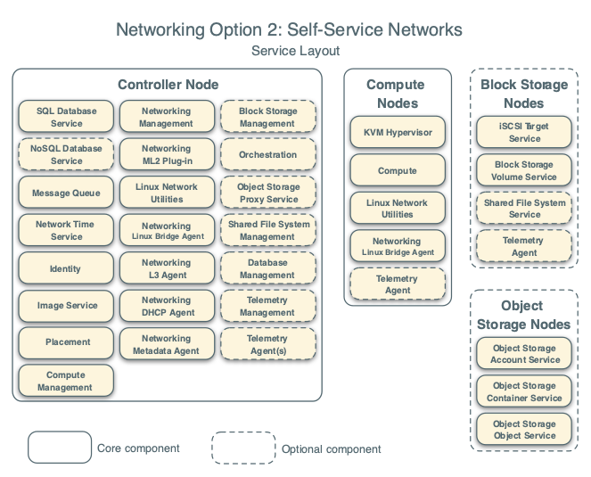

.. _openstack_install_overview:

========================
OpenStack 安装概览
========================

OpenStack是一个支持所有类型运计算环境的开源云计算平台。项目的目标是简化事实，强大的伸缩性以及丰富的功能。

OpenStack通过多种互补的服务提供了基础架构即服务(Infrastructure-as-a-Service, IaaS)解决方案，每个服务提供了应用程序编程接口(Application Programming Interface, API)来促进这个集成。

这里的 :ref:`openstack_installation` 是一步步完成主要的OpenStack服务实现一个新用户可工作案例架构，虽然不是生产环境系统安装，但是创建了一个最小化可验证的OpenStack部署。

在熟悉了基本安装、配置、操作和故障排查之后，就可以进一步实现生产环境架构的 :ref:`openstack_deployment` :

- 决策和实现必要的核心和可选服务来实现性能和容灾的优化
- 使用防火墙、加密和服务策略来增强安全
- 通过Ansible, Chef, Puppet 或 Salt来自动化部署和管理产品环境

案例架构
===========

我的部署实践是在3台物理服务器上实现OpenStack的微型架构，底层基础服务架构将混合裸机和Docker来运行，以便获得最佳性能：例如，消息队列、数据库、分布式存储。

组件：

- 管控
- 计算
- 块存储
- 对象存储
- 网络

网络选型
-----------

OpenStack有两种网络选型：

- Provider networks:
  主要是2层(交换)网络服务和VLAN分片网络。基础是将虚拟网络桥接到物理网络并且依赖物理网络架构来实现三层(路由)服务。另外，一个DHCP服务提供IP地址信息给虚拟机实例。

.. note::

   这是一种比较简单的经典网络结构

- Self-service networks:

自服务网络选型是采用VXLAN这样的overlay分片方式实现self-service networks。底层，使用NAT将虚拟网络路由给物理网络，这个网络选型提供了高级服务功能，例如LBaaS和FWaaS。

OpenStack用户可以在不知道底层数据网络的情况下构建虚拟网络，包括VLAN网络，如果配置了layer-2插件。

.. note::

   我采用Self-service network，以便实现VXLAN的虚拟网络。

- 
