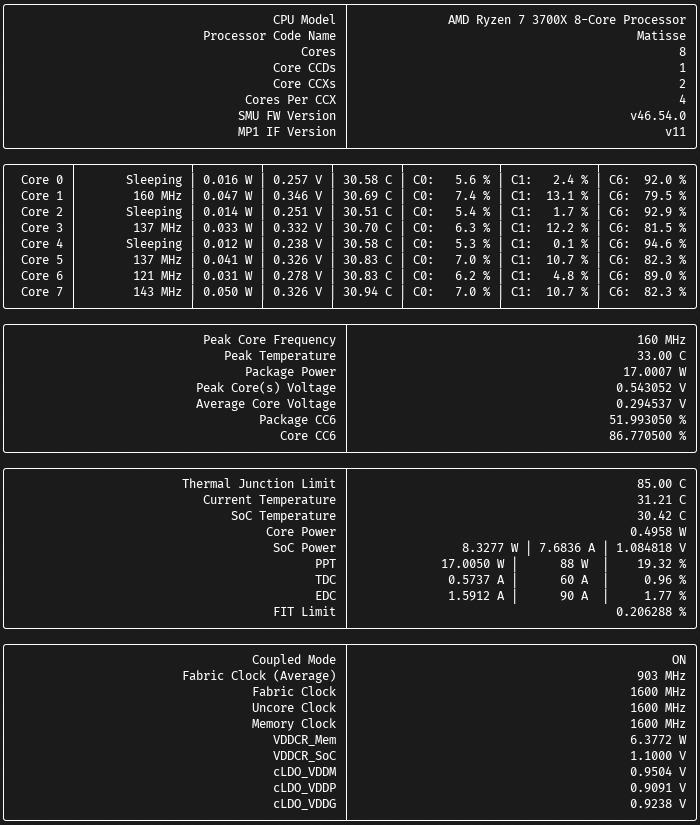
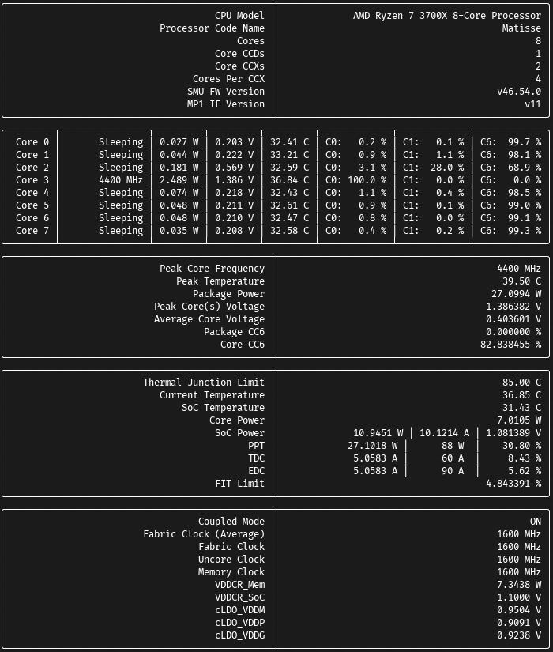
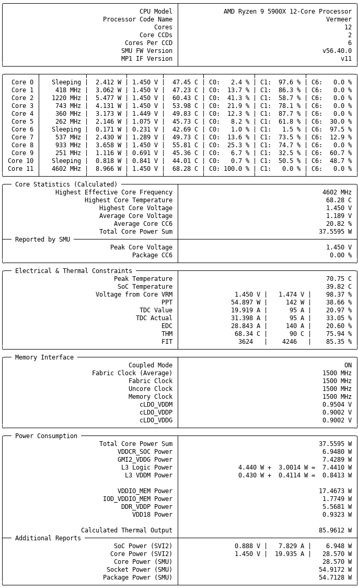

.. _amd_ryzen_smu:

===========================================
AMD Ryzen处理器SMU(System Management Unit)
===========================================

`ryzen_smu <https://gitlab.com/leogx9r/ryzen_smu>`_ 内核模块提供输出AMD Ryzen处理器SMU(System Management Unit)，提供了性能监控的基础框架:

如果需要，可以考虑在这个基础上开发定制针对AMD处理器的监控: 例如， `ryzen_monitor (GitHUb) <https://github.com/hattedsquirrel/ryzen_monitor>`_ 就是基于 ``ryzen_smu`` 内核模块开发的，使用非常方便，能够对AMD处理器进行一些硬件特性监控。终端使用，简单清晰:

