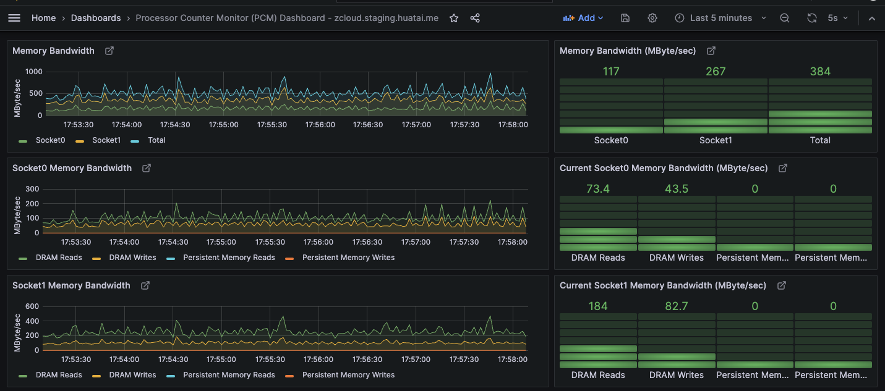
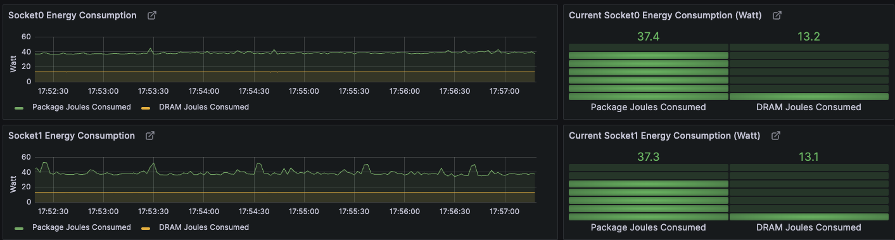

.. _pcm-grafana:

==================
Intel PCM Grafana
==================

.. note::

   Intel早期(2022年11月停止开发)还开发过一个 `Snap Telemetry Framework (GitHub) <https://github.com/intelsdi-x/snap>`_ 也可以和Grafana结合观测Intel处理器( `Grafana Labs and Intel partner on Grafana and Snap <https://grafana.com/blog/2016/04/11/grafana-labs-and-intel-partner-on-grafana-and-snap/>`_ )，可以参考实现方式。不过，目前看Intel PCM是Intel官方持续开发，并且在Linux主要发行版都提供，提供了非常详细的处理器监控。

.. note::

   `pcm/scripts/grafana/README.md <https://github.com/intel/pcm/blob/master/scripts/grafana/README.md>`_ 提供了通过脚本拉起 :ref:`grafana` 和 :ref:`prometheus` 容器的方法，不过我准备自己独立部署 Grafana 和 Prometheus (同时监控多项服务器目标)，然后将 Intel :ref:`pcm-exporter` 采集数据集成

快速起步
===========

在部署 ``Intel PCM Grafana`` 之前，需要先在被监控服务器上运行 :ref:`pcm-exporter` 提供 :ref:`metrics` 输出

在 `Intel PCM(GitHub) <https://github.com/intel/pcm>`_ 源代码目录下提供了通过 :ref:`docker` 运行的脚本，执行以下命令可以拉起2个容器分别运行 :ref:`prometheus` 和 :ref:`grafana` 并且传递参数可以指定监控服务器:

.. literalinclude:: pcm-grafana/docker_pcm
   :caption: 使用 `Intel PCM (GitHub) <https://github.com/intel/pcm>`_ 源代码提供了 :ref:`docker` 运行的脚本运行监控

这里 ``scripts/grafana`` 目录下提供了多种 :ref:`docker` 容器化运行的方法:

- ``start.sh`` 启动 ``telegraf/influxdb/grafana`` 容器
- ``start-prometheus.sh`` 启动 ``prometheus + grafana`` 容器
- 支持对多个目标服务器监控，只需要提供一个 ``targets.txt`` 包含以下格式内容就可以运行 ``sudo sh start-prometheus.sh targets.txt`` ::

   host1_ipaddress:pcmport
   host2_ipaddress:pcmport
   .
   .
   hostn_ipaddress:pcmport

启动完成后，检查容器 ``docker ps`` 可以看到2个运行容器:

.. literalinclude:: pcm-grafana/docker_ps_pcm_containers
   :caption: ``docker ps`` 可以看到运行了 ``prometheus`` 和 ``grafana`` 两个容器

- 然后就可以使用 浏览器访问 http://192.168.6.200:3000 看到 :ref:`grafana` ，使用 ``admin`` 账号密码 ``admin`` 登陆(登陆后会提示立即修改密码)o

对于我的简陋的 :ref:`xeon_e5-2600_v3` 能够观察内存带宽使用，以及能耗，不过很多高级监控功能没有数据，应该是需要硬件支持才能实现:

解析
-------

- 登陆 ``prometheus`` 容器内部检查配置，可以帮助我们理解配置方法为后续独立部署做准备:

.. literalinclude:: pcm-grafana/docker_exec_prometheus
   :caption: 通过 ``docker exec`` 进入prometheus容器内部检查

- 找到 ``/etc/prometheus/prometheus.yml`` 可以看到一个非常简单的配置:

.. literalinclude:: pcm-grafana/prometheus.yml
   :caption: 监控配置 ``/etc/prometheus/prometheus.yml``
   :emphasize-lines: 23,28,29

也就是说，其实只需要添加目标地址，其他都采用了默认的 :ref:`prometheus` 配置

此外，如果采用上文 ``targets.txt`` 来存储和传递监控目标服务器，则上述 ``/etc/prometheus/prometheus.yml`` 的 ``static_config`` 部分会依次添加IP地址

配置
======

既然已经验证过上述 ``快速起步`` ，现在可以使用 :ref:`prometheus_startup` 部署的prometheus 和 :ref:`install_grafana` 部署的grafana (也就是我直接在物理主机 ``zcloud`` 上通过 :ref:`systemd` 运行的监控系统)。配置非常简单:

- 在 ``/etc/prometheus/prometheus.yml`` 的 ``scrape_configs:`` 段落添加:

.. literalinclude:: pcm-grafana/prometheus_add.yml
   :caption: ``zcloud`` 主机上监控配置 ``/etc/prometheus/prometheus.yml`` 只需要 ``scrape_configs:`` 段落添加

- 重启 ``prometheus`` 服务::

   sudo systemctl restart prometheus

- 在Grafana的Dashboard中导入 `Grafana Dashboard 17108: Processor Counter Monitor (PCM) Dashboard <https://grafana.com/grafana/dashboards/17108-processor-counter-monitor-pcm-dashboard/>`_ （这是第三方提供的Dashboard，其实和官方提供监控内容相似)

- 直接使用Intel PCM官方 :ref:`pcm-exporter` 提供的Dashboard JSON配置文件需要修订一下数据源，将::

   "datasource": "prometheus",

替换成在之前导入Dashboard 17108中配置选择的数据源，例如(这里随机字符串就是我的prometheus数据源)::

      "datasource": {
        "type": "prometheus",
        "uid": "dacebb35-68e7-4f3c-aef2-de8d70cb8bd6"
      },

就可以正常工作

参考
=====

- `Grafana Dashboard 17108: Processor Counter Monitor (PCM) Dashboard <https://grafana.com/grafana/dashboards/17108-processor-counter-monitor-pcm-dashboard/>`_
