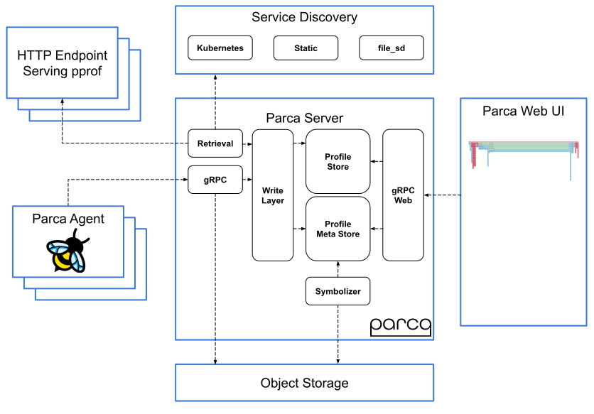

.. _intro_parca:

===============================
Parca持续分析平台简介
===============================

``Parca`` 是 `Polar Signals公司 <https://www.polarsignals.com/>`_ 开源的持续性能分析软件。该项目开源网站 `parca.dev <https://www.parca.dev/>`_ 提供了详细 `Parca Docs <https://www.parca.dev/docs/overview>`_ 解释了软件的实现以及应用

.. note::

   ``Parca`` 英文原意是 **命运三女神**

.. note::

   ``Parca`` ( ``Polar Signals`` 是商业化产品 ) 采用了Google开发的 :ref:`pprof`

.. note::

   ``Parca`` 的 bpf 分析方式实际上和 :ref:`pcp` 的 ``bpftrace`` PCMA 类似，两者可以对比验证

架构
======

- Parca Agent采用了 :ref:`ebpf` **实时** 获取Linux :ref:`kernel` 数据
- Parca Server

参考
=======

- `Parca Docs <https://www.parca.dev/docs/overview>`_
