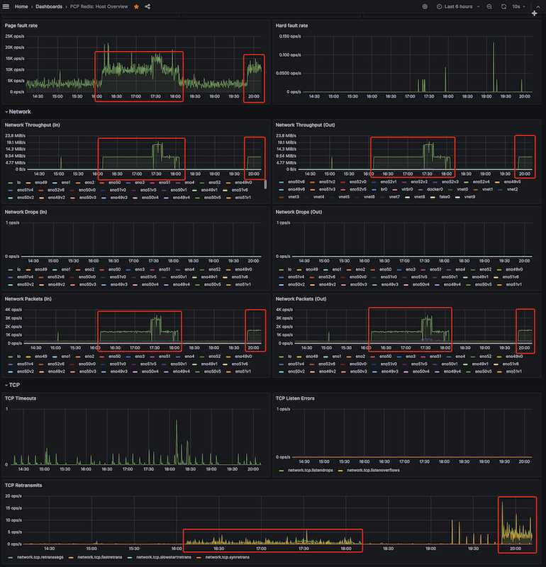
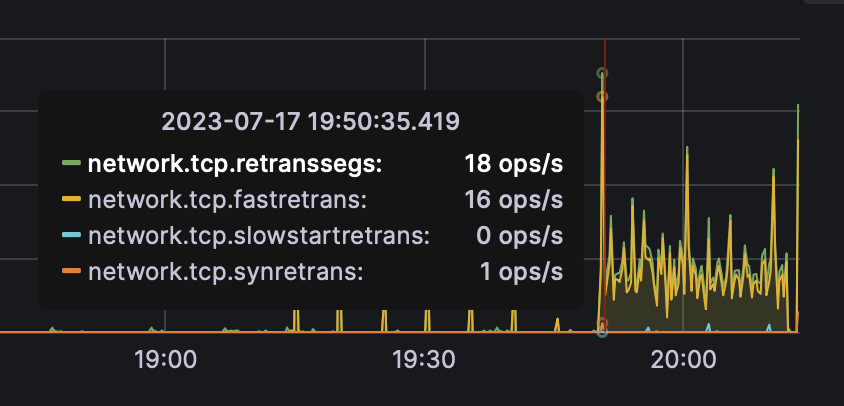
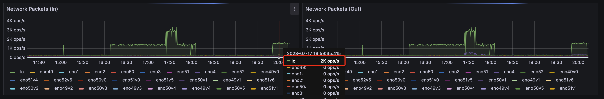
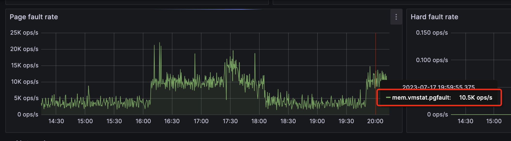
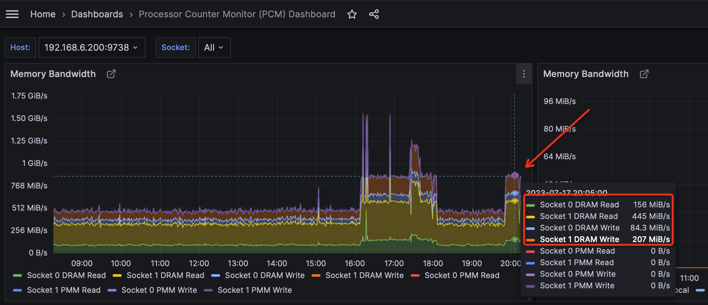

.. _debug_pcp_high_network:

=======================
排查PCP网络暴增异常
=======================

我在 ``zcloud`` 上尝试启用了不同的 ``pdca`` ，但是我突然发现自己的服务器出现了非常奇怪的网络流量暴增。

检查 ``top`` :

.. literalinclude:: debug_pcp_high_network/top_high_redis
   :caption: ``top`` 显示

可以看到 ``pcp_redis_datasource_linux_amd64`` 和 ``pmproxy`` 周期性非常消耗CPU资源

我观察到下午 16:08 开始，过一段时间就会出现一个网络流量高峰，并且集中在 ``lo`` 回环地址上:

并且，会出现比较明显的 TCP重传:

此时 ``lo`` 接口上的网络包达到2Kops/s

观察 ``PCP Redis: Host Overview`` 的 ``Page fault rate`` 也看到明显的 ``mem.vmstat.pgfault`` 飙升:

此外，观察 :ref:`intel_pcm` 面板，可以看到 ``Memory Bandwidth`` 也非常繁忙:

排查
========

- 初步可以判断是启用了 :ref:`pcp` 监控 ``pmda`` 导致的 :ref:`redis` 大量读写，但是:

  - 为何是周期性的峰值?
  - :ref:`pcp` 的 ``pmda`` 到底写入了什么数据?
  - 怎么排查 :ref:`pcp` 的性能数据抓取活动?

- 最初我怀疑是安装到 ``pmda`` 导致的，所以依次把怀疑可能有性能影响到 ``pmda`` 都 ``Remove`` 了。但是没有想到丝毫没有缓解问题

- 偶然发现，其实这个 ``lo`` 网络流量暴增，实际上和 ``PCP Redis`` 有关，也就是 :ref:`grafana-pcp` 插件安装以后，选择了数据源 ``PCP Redis`` 来构建的 ``PCP Redis: Host Overview`` 面板:

  - 当切换到 ``PCP Redis: Host Overview`` Dashboard时候，就会看到 ``Network`` 流量暴增
  - 当浏览器切换到其他页面， ``Network`` 就会恢复到常规流量水平(也就是说当浏览器页面非激活状态，即鼠标没有点该监控页面)，此时 :ref:`grafana` 就不会调用 :ref:`grafana-pcp` 刷新 ``PCP Redis`` 数据源数据

结论暂定
=========

看来这个PCP网络流量暴增并没有什么影响，只是Grafana的页面渲染需要不断读取数据源导致。我这台监控观察的恰好就是Redis主机，所以观察到这个现象。相信后续做分布式监控，当有监控页面观察时，都会出现这种Redis流量暴增的现象。

.. note::

   :ref:`pgfault` 的说明(好奇)
