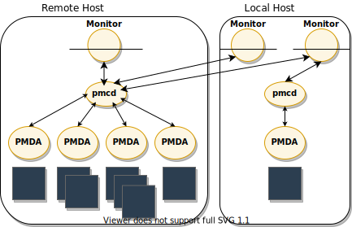
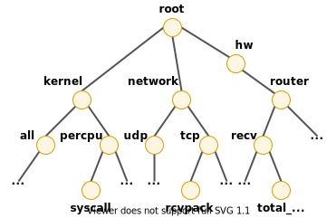
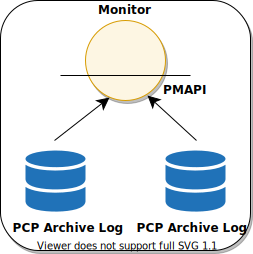

.. _intro_pcp:

=========================
Performance Co-Pilot简介
=========================

`Performance Co-Pilot <https://pcp.io/>`_ 是一种轻量级性能采集工具框架:

- 轻量级: 通过搜集性能 :ref:`metrics` 能够有效分析系统性能
- 分布式: 可以从不同主机以及不同操作系统搜集 ``metrics`` 数据
- 自包含: 在所有主要Linux发行版都提供，包括 :ref:`redhat_linux` :ref:`fedora` ``debian`` :ref:`ubuntu_linux` :ref:`suse_linux` :ref:`gentoo_linux`
- 可扩展: 提供插件框架(libraries, APIs, agents 和 daemon)可以从不同来源搜集性能数据，包括硬件，内核，服务，应用库以及应用

PCP采用插件框架可以适合中心化分析复杂的环境和系统，用户可以使用C, C++, Perl 和 Python 接口定制和添加性能metrics。

.. note::

   `Performance Co-Pilot(WikiPedia) <https://en.wikipedia.org/wiki/Performance_Co-Pilot>`_ 历史非常悠久，最早(1993年10月)是在SGI(商业Unix)上开发的，1995年发布了SGI IRIX操作系统的附加软件Performance Co-Pilot 1.0。到了2000年，PCP的核心重新在GNU LGPL协议下发布。当前已经成为很多Linux发行版内置提供的软件包。

   Red Hat很早就开始在RHEL中提供PCP，并且在RHEL 7 到现在的 RHEL 9的性能优化手册中，都推荐采用PCP来做性能监控和分析。

`Performance Co-Pilot <https://pcp.io/>`_ 提供面向整体性能的监控，以及需要了解复杂系统的性能、资源利用率和瓶颈分析的需求。能够服务于大型服务器、服务器集群以及多服务器站点，包括数据库、计算、web和文件或视频服务:

- 集成的工具、用户界面和服务，支持实时和回顾性性能分析
- 在底层(操作系统内核，DBMS，分层服务或最终用户应用程序)提供各种性能指标域代理(Performance Metrics Domain Agents, PMDAs)，封装了有关自治域的知识，并从中导出性能数据: Performance Metrics Domain Agents (PMDAs) within PCP encapsulate the knowledge about, and export performance information from, autonomous performance domains.
- 统一命名和访问性能指标: 采用统一的命名性能指标(跨架构?)，构成了性能指标名称空间(Performance Metrics Name Space, PMNs)，提供单一界面来命名和检索所有性能指标值，不论其来源或位置。
- 动态适应变化: 复杂集群不断变化(故障、升级、变更等等)，PCP分布式特性能够适应受监控系统的花花，客户端会自动重新连接并报告
- 记录和回放: PCP归档日志，提供监控回放
- 可扩展性: 能够将新的性能指标集成到PMNS，对于应用开发人员，提供了一个库支持在应用程序中插入跟踪和监控点，可以将结果性能数据自动导出懂啊PCP框架(发行版中提供了源代码示例，以便定制性能或服务性度量可以集成到PCP框架中)

PCP基础概念
============

.. note::

   PCP基础概念涉及性能指标的很多概念，我看得也是云里雾里；先这样吧...具体请参考原文

- 性能指标: 在性能指标领域有大量的性能指标，每个指标有自己的结构和语义，PCP为指标提供了统一接口，独立于底层指标数据源
- 性能指标实例: 瞬间态性能指标对于同一个指标的重复请求会返回不同数值
- 当前指标上下文(context)
- 性能metrics的来源和作用域: 每个域都有一个关联的访问方法

  - 操作系统内核: 子系统数据结构(每个进程的资源消耗，网络、磁盘或内存的资源消耗)
  - 分层软件服务: web服务哦和电子邮件服务端 活动日志
  - 应用程序: 对运行的应用程序定期探测，应用的响应实践、每分钟计算旅和吞吐量

- 性能指标(performance metrics)是抽象的数据类型，但是性能指标会随着软件和硬件的组合变化以及时间而变化
- 性能指标域(performance metrics domins)需要有唯一的性能标识符(Performance Metric Identifier, PMID)，相同的标识符可以用于所有主机上的性能指示

- 分布式采集: PCP的性能指标采集是分布式架构, PMDA在采集性能数据的系统上运行，而PMCD进程负责将这些工具连接起来:

   PCP远程采集示意图

运行 monitoring 工具的主机不需要任何采集工具，包括 ``pmcd`` 也不需要安装，这是因为所有的metrics的请求都是发送给采集主机的 ``pmcd`` 。这些请求再被转发给 ``pmda`` ，也就是实际负责metric描述，帮助文本，以及metrics值:

  - 在监控客户端和 ``pmcd`` 进程之间的连接是通过 ``libpcp`` 管理的，运行层低于 PMAPI
  - ``pmda`` 和 ``pmcd`` 之间的连接则有 ``pmda`` routines管理
  - 在一个主机上可以运行多个监控客户端和多个 ``pmda`` ，但是通常只有一个 ``pmcd`` 进程

- Performance Metrics Name Space(性能指标命名空间):

  - PMNS树类似DNS结构的倒立树状结构
  - PMNS树的每个节点都分配一个标签，标签必须以字母字符开头，后面跟0个或多个字母数字字符或下划线；树的根节点则有一个特殊标签 ``root``

   PMNS树状结构(类似DNS)

在上述案例中， ``performance metrics`` 案例::

   kernel.percpu.syscall
   network.tcp.rcvpack
   hw.router.recv.total_util

- Performance Metrics描述:

  - ``单值`` 性能指标(Single-Valued Performance Metrics): 一些性能指标对于一个主机只有一个值，例如可用内存，上下文切换总数等
  - ``集合-值`` 性能指标(Set-Valued Performance Metrics): 在性能度量域有一组值或实例，例如主机有很多个磁盘，主机中运行了很多进程，主机中CPU有很多个core。性能指标 ``disk.dev.total`` 对每个磁盘轴的I/O操作进行计数，并且关联的实例域包含每个磁盘轴的一个成员。

- 采集器(Collector)和监控(Monitor)角色(每个启用PCP的主机可以作为Collector或Monitor，或者同时两者):

  - 采集器(Collector): 运行 ``pmcd`` 和 ``pmda`` 来采集性能指标的主机
  - 监控(Monitor): 负责导入性能指标(metrics)的主机

- 性能指标(Performance Metrics)的回放源(Retrospective Source):

  - ``PMAPI`` 支持以PCP归档日志的历史源传输性能指标，也就是监控性能指标回放:

   Performance Metrics回放

- PCP扩展性:

  - Performance Analyst可以使用PCP基础设施来部署性能监控工具和服务
  - 可以自定义开发PMDA来实现新的性能指标
  - ``libpcp_pmda`` 和 ``libpcp_mmv`` 可以从本地应用程序导出性能指标
  - 可以在网络中分布部署性能采集器，而服务器端集中处理

PCP组件
=========

Performance Monitor和可视化
-----------------------------

- ``pcp-atop``
- ``pmchart``
- ``pcp-collectl``
- ``pmrep``
- ``pmevent``
- ``pmie``
- ``pmieconf``
- ``pminfo``
- ``pmlogsummary``
- ``pmprobe``
- ``pmstat``
- ``pmval``

采集、传输和归档 性能信息
---------------------------

- ``mkaf``
- ``pmafm``
- ``pmcd``
- ``pmcd_wait``
- ``pmdaapache`` :ref:`apache` 性能数据采集
- ``pmdacisco`` Cisco路由器性嫩数据采集
- ``pmdaelasticseach``
- ``pmdagfs2``
- ``pmdagluster`` :ref:`gluster` 性能数据采集
- ``pmdainfiniband``
- ``pmdakvm`` :ref:`kvm` 架构虚拟机性能采集
- ``pmdalustrecomm``
- ``pmdamailq``
- ``pmdamemcache`` memcached 性能数据采集
- ``pmdammv`` Java Parfait框架的性能数据采集
- ``pmdamysql`` :ref:`mysql` 数据库性能数据采集
- ``pmdanamed`` DNS服务器 ``named`` 性能采集
- ``pmdanginx`` :ref:`nginx` 性能采集
- ``pmdapostfix`` Postfix邮件服务器性能采集
- ``pmdapostgres`` :ref:`pgsql` 数据库性能采集
- ``pmdaproc`` 运行进程的性能采集
- ``pmdarsyslog``
- ``pmdasamba`` Samba性能采集
- ``pmdasendmail``
- ``pmdashping``
- ``pmdasnmp``
- ``pmdasummary``
- ``pmdasystemd`` :ref:`systemd` 和 journald 服务的性能采集
- ``pmdatrace`` 使用 ``pcp_trace`` 库的应用程序进程性能采集
- ``pmdavmware`` VMWare虚拟机性能采集
- ``pmdaweblog``
- ``pmdaxfs`` :ref:`xfs` 性能采集
- ``pmdumplog`` **pmlogger** 归档PCP日志的性能
- ``pmlc`` 
- ``pmlogcheck``
- ``pmlogconf``
- ``pmlogextract``
- ``pmlogger``
- ``pmproxy`` 提供REST API
- ``pmtrace``

运行和基础设施支持
-------------------

应用程序和Agent开发
---------------------

参考
======

- `Performance Co-Pilot Features <https://pcp.io/features.html>`_
- `PCP Quick Reference Guide: Introduction <https://pcp.readthedocs.io/en/latest/QG/QuickReferenceGuide.html#introduction>`_
- `Performance Co-Pilot(WikiPedia) <https://en.wikipedia.org/wiki/Performance_Co-Pilot>`_
- `PCP docs: Introduction to PCP <https://pcp.readthedocs.io/en/5.2.4/UAG/IntroductionToPcp.html>`_
