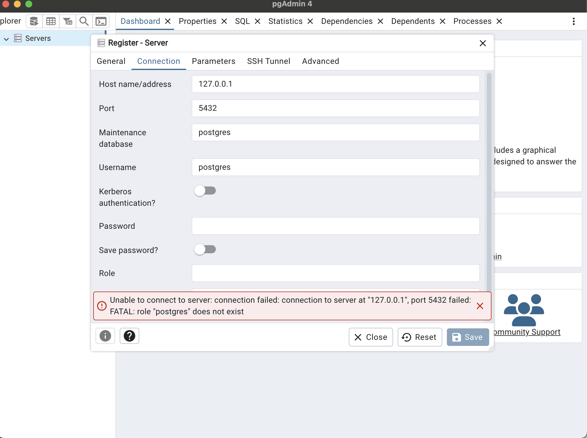
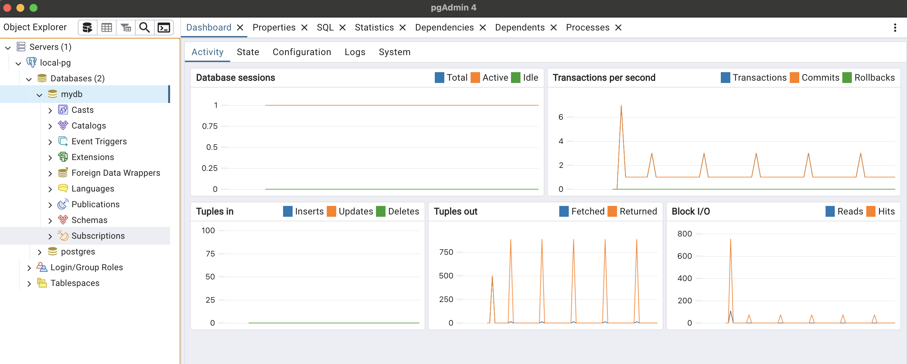

.. _pgadmin:

================
pgAdmin
================

`pgAdmin - PostgreSQL管理工具 <https://www.pgadmin.org>`_ 是最流行的开源 PostgreSQL管理工具:

- 支持不同平台不同版本的PostgreSQL和EDB Postgres Advanced Server的管理
- 两种部署模式: 桌面模式(使用electron) 和 服务器模式(通过web允许多用户同时使用)
- 语法高亮的强大查询工具
- 图形化查询计划显示
- 通过引导来帮助更新ACL
- 过程语言调试(pl/pgsql和edb-sql支持)
- 通过Schema diff工具俩管理不同的schemas
- 自动回收管理
- 监控
- 备份、恢复、垃圾回收和按需分析
- SQL/shell/批任务 调度代理

启动配置
===========

我的测试环境是在 :ref:`install_pgsql_macos` ，采用 :ref:`homebrew` 安装完成后，通过命令行启动:

.. literalinclude:: ../install/install_pgsql/command_postgresql
   :caption: 使用命令启动 PostgreSQL

然后配置 ``pgadmin`` 来访问这个本地PostgreSQL数据库，所以配置访问 ``127.0.0.1`` 端口 ``5432`` ，但是初次访问提示 ``FATAL: role "postgres" does not exit`` :

   访问本地PostgreSQL显示 ``postgres`` 角色不存在

参考 `psql: FATAL: role "postgres" does not exist <https://stackoverflow.com/questions/15301826/psql-fatal-role-postgres-does-not-exist>`_ ，对于通过 :ref:`homebrew` 完成的 :ref:`install_pgsql_macos` ，需要执行以下命令创建一个 ``postgres`` 用户:

.. literalinclude:: ../install/install_pgsql/brew_pgsql_createuser
   :caption: 通过 :ref:`homebrew` 安装的PostgreSQL，需要创建一个 ``postgres`` 系统用户角色

创建了 ``postgres`` 系统用户之后，就可以正常访问并看到dashboard:

参考
======

- `pgAdmin - PostgreSQL管理工具 <https://www.pgadmin.org>`_ 官网
- `pgAdmin User Management in Server Mode <https://www.enterprisedb.com/blog/pgadmin-user-management>`_
- `pgAdmin 4 8.13 documentation » Getting Started » Deployment » Server Deployment <https://www.pgadmin.org/docs/pgadmin4/latest/server_deployment.html>`_
- `psql: FATAL: role "postgres" does not exist <https://stackoverflow.com/questions/15301826/psql-fatal-role-postgres-does-not-exist>`_
