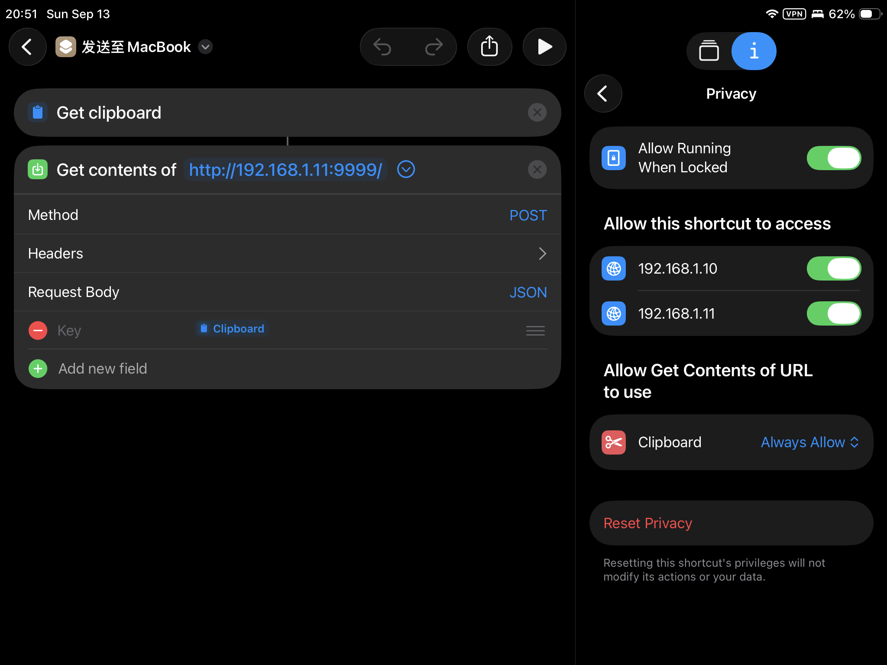
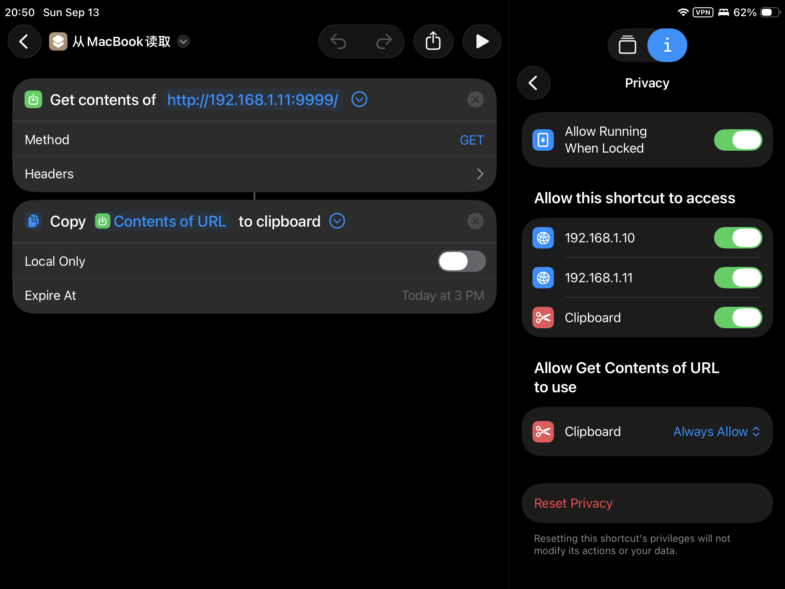

.. _python_http_clip_server:

===========================
Python实现简易剪贴板服务
===========================

我在使用 :ref:`bt-keyboard-switcher` 为 :ref:`alpine_sway_mba11_late_2010` 提供蓝牙键盘模拟来为 :ref:`ipad_mini5` 快捷输入，但是存在一个问题是，两个系统 Linux + iPad OS之间复制粘贴数据困难，特别是我依赖iPad来完成网页浏览和AI问答，总有文本数据需要传输给 :ref:`alpine_linux` 系统使用。

利用 Python 自带的库创建一个 ``clip_server.py`` :

.. literalinclude:: python_http_clip_server/clip_server.py
   :caption: 简易剪贴板服务
   :language: python

在 Macbook 的 :ref:`alpine_linux` 系统中运行上述服务，监听在 ``9999`` 端口上:

.. literalinclude:: python_http_clip_server/run_clip_server
   :caption: 运行剪贴板服务

在 Macbook 的 :ref:`alpine_linux` 设置 ``~/.profile`` 添加以下2个alias:

.. literalinclude:: python_http_clip_server/profile
   :caption: 设置 ``~/.profile``

iPad端设置快捷方式
====================

创建“发送至 MacBook”快捷指令 (iPad ➜ Alpine)
-----------------------------------------------

- 新建快捷指令:

  - 打开 iPad 上的 ``Shortcuts`` (快捷指令) App，点击右上角 ``+`` 新建
  - 名称重命名为：``发送至 MacBook``

- 添加步骤 1: ``Get clipboard``
- 添加步骤 2: ``Get contents of URL``

  - URL填写为服务地址，例如我这里填写 ``http://192.168.1.11:9999``
  - 点击该动作右侧的展开箭头，修改以下参数:

    - 方法 (Method)：选择 ``POST``
    - 请求正文 (Request Body)：选择 ``JSON``
    - 点击下面的 ``Add new field`` ，直接在内容中选择 ``Clipboard``

- 先在iPad上复制一段文本，然后点击快捷指令的 播放图标 "▶️" 

- 此时在Macbook上运行的 ``clip_server.py`` 日志中应该看到有 ``POST`` 日志输出，并用主机上刚才设置的 ``alias`` 的命令 ``cfromipad`` 把数据放到本机的剪贴板中。接下来在任何文本编辑程序中粘贴验证

创建“从 MacBook 读取”快捷指令 (Alpine ➜ iPad)
--------------------------------------------------

- 新建快捷指令，命名为 ``从 MacBook 读取``
- 添加步骤 1: ``Get contents of URL``

  - URL填写为服务地址，例如我这里填写 ``http://192.168.1.11:9999``
  - 方法保留默认的 ``GET``

- 添加步骤 2: ``Copy contents to Clipboard``

.. note::

   为方便使用可以在iPad上将快捷方式放到桌面以及作为下拉菜单小组件

.. warning::

   本文的剪贴板服务是非常简单的开放端口服务，没有任何认证，所以存在安全隐患。为加强安全，我感觉只能在家庭的局域网内使用，日常使用应该通过 :ref:`tailscale` 来固定在局域网内部的一台服务器上提供服务，以便能够给个人简单使用。

Sway环境快捷键设置
====================

- 确保已安装必要工具:

.. literalinclude:: python_http_clip_server/install_tools
   :caption: 安装工具软件

- 在 Sway 配置文件中添加快捷键绑定:

.. literalinclude:: python_http_clip_server/sway_config
   :caption: sway配置文件 ``~/.config/sway/config``

参数说明:

- ``--no-startup-id`` 避免按快捷键时出现等待鼠标指针
- 推送命令中使用 ``jq -sR '{text: .}'`` 能自动将多行代码或包含引号/换行符的文本安全转义为标准 JSON 格式。

参考
=======

- gemini
