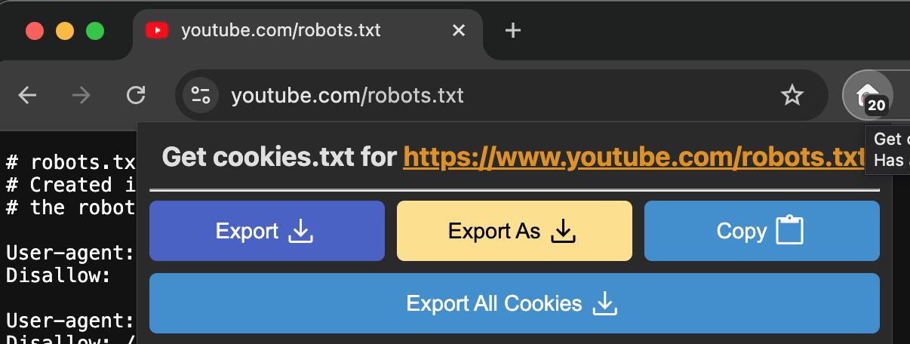

.. _yt-dlp:

=================
yt-dlp
=================

`yt-dlp开源项目 <https://github.com/yt-dlp/yt-dlp>`_ 是 :ref:`youtube-dl` 的fork项目，提供了新功能和patch(合并了很多修复)，可以解决一些下载问题。

安装
=======

- ``pip`` 安装::

   python3 -m pip install -U yt-dlp

- :ref:`homebrew` 安装::

   # 安装
   brew install yt-dlp
   # 更新
   brew upgrade yt-dlp

.. note::

   配置方法和 :ref:`youtube-dl` 基本相同，例如配置文件是 ``~/.config/yt-dlp/config``

提取cookies
=============

.. warning::

   2025年时是用 ``yt-dlp`` 可以通过cookies来访问和下载YouTube视频，但是由于YouTube收紧了安全限制，当前(2026年)已经无法简单通过cookies来访问YouTube。

.. note::

   由于YouTube处于安全会经常轮转cookies，所以需要导出一个不会变化的cookies，也就是 ``robots`` 使用的cookies

要下载油管文件，需要为 ``yt-dlp`` 提供cookies。有以下一些方法

使用 ``yt-dlp`` 提取chrome的cookies
-------------------------------------

``yt-dlp`` 无需使用第三方就可以提取chrome浏览器的cookie:

.. literalinclude:: yt-dlp/cookies-from-browser
   :caption: 提取chrome的cookies

上述命令将浏览器的cookies保存为cookies.txt文件。这个cookies.txt文件后续就可以 ``--cookies`` 参数用于下载油管文件。不过，需要注意这个cookies.txt包含了所有网站的cookies，所以一定要保障安全。

使用 ``chrome`` 保存cookies
------------------------------

``chrome`` 的私有浏览窗口可以导出cookies:

- 在浏览器中使用一个新的 private browsing/incognito 窗口，并登陆到YouTube
- 在同一个窗口和相同的tab中，访问 ``https://www.youtube.com/robots.txt``
- 使用第三方export cookies来输出当前incognito窗口的cookies:

  - chrome推荐使用 `Get cookies.txt LOCALLY chrome插件 <https://chromewebstore.google.com/detail/get-cookiestxt-locally/cclelndahbckbenkjhflpdbgdldlbecc>`_ (注意: **需要在插件管理页面勾选 "Allow in Incognito" 才能在隐私页面中使用** )，点击 ``Export`` 按钮导出Cookies(如果还报cookies错误，可能需要重新导出?)
  - firefox推荐使用 `cookies.txt firefox插件 <https://addons.mozilla.org/en-US/firefox/addon/cookies-txt/>`_

   在chrome中激活 "Allow in Incognito" 选项以后可以使用 ``Get cookies.txt LOCALLY chrome插件`` 保存当前页面的cookies

.. note::

   chrome处于incongnito状态时，代理配置使用的是系统设置proxy(默认情况下常规的proxy插件不生效，除非配置 "Allow in Incognito")。我是通过设置系统代理方式来实现incognito 窗口访问YouTube

JavaScript支持
=================

在2025年使用 ``yt-dlp`` 的时候，例如，下文的使用其扫描 `《杀死那个石家庄人》--万能青年旅店 影视混剪MV <https://www.youtube.com/watch?v=npHbCnf-Lpk>`_

.. literalinclude:: yt-dlp/get_list
   :caption: 获取指定YouTube的URL中文件列表

可能会出现无法找到JavaScript运行时的报错(如果系统没有安装 :ref:`nodejs` 的话):

.. literalinclude:: yt-dlp/get_list_error
   :caption: 获取指定YouTube的URL中文件列表报错: 没有找到JS运行时
   :emphasize-lines: 4,5

按照提示参考 `yt-dlp: External JS Scripts Setup Guide <https://github.com/yt-dlp/yt-dlp/wiki/EJS>`_ 安装一个支持的JavaScript Runtime。其中推荐 ``Deno`` 

不过，我实际上在 :ref:`macos_studio` 中使用了 :ref:`mise` 安装了 :ref:`nodejs` ，所以这里可以通过传递参数 ``--js-runtimes node`` 或 ``--js-runtimes node:~/.local/share/mise/installs/node/24/bin/node`` 来解决:

.. literalinclude:: yt-dlp/get_list_nodejs
   :caption: 通过指定nodejs作为JavaSrcipt runtime获取指定YouTube的URL中文件列表

不过，我有遇到新的报错:

.. literalinclude:: yt-dlp/get_list_error_1
   :caption: 提示需要 solver script 来解决remote component challenge
   :emphasize-lines: 6

这是因为 ``yt-dlp`` 需要EJS challenge solver脚本才能通过YouTube的challenge，如果没有执行安装 ``pip install -U "yt-dlp[default]"`` 就没有包含这个 ``yt-dlp-ejs`` 包，所以这里需要下载和激活ejs脚本:

- ``yt-dlp`` 可以自动从GitHub下载( https://github.com/yt-dlp/ejs )EJS脚本:

.. literalinclude:: yt-dlp/get_list_nodejs_ejs
   :caption: 增加 ``--remote-components ejs:github`` 参数可以自动下载和更新ejs

使用
=====

我非常喜欢的 `《杀死那个石家庄人》--万能青年旅店 影视混剪MV <https://www.youtube.com/watch?v=npHbCnf-Lpk>`_

- 首先获取视频列表:

.. literalinclude:: yt-dlp/get_list_nodejs_ejs
   :caption: 获取指定YouTube的URL中文件列表(2026年方法)

这里参数 ``--cookies www.youtube.com_cookies.txt`` 是指定刚才从chrome的Incognito页面export出来的cookie文件

显示输出:

.. literalinclude:: yt-dlp/yt-dlp_list_format
   :caption: ``yt-dlp -F`` 列出下载视频的输出案例 **《杀死那个石家庄人》--万能青年旅店 影视混剪MV**
   :emphasize-lines: 29

我来下载最小的一个视频mp4，编号 ``18`` :

.. literalinclude:: yt-dlp/get_file_nodejs_ejs
   :caption: 下载指定YouTube URL中文件(2026年方法)

.. note::

   请注意，上述列表中，很多视频文件是没有声音的( ``video only`` )，有些则只有声音( ``audio only`` )。如果你需要一个完整的有声音的视频，务必 **不要** 选择 ``video only`` 。

显示输出::

   [youtube:tab] Extracting URL: https://www.youtube.com/watch?v=npHbCnf-Lpk
   [youtube:tab] Downloading playlist PLnqzKl0S_xnl8xgGJxWKDPuFrgafqSEfo - add --no-playlist to download just the video npHbCnf-Lpk
   [youtube:tab] PLnqzKl0S_xnl8xgGJxWKDPuFrgafqSEfo: Downloading webpage
   WARNING: [youtube:tab] Unable to recognize playlist. Downloading just video npHbCnf-Lpk
   [youtube] Extracting URL: https://www.youtube.com/watch?v=npHbCnf-Lpk
   [youtube] npHbCnf-Lpk: Downloading webpage
   [youtube] npHbCnf-Lpk: Downloading android player API JSON
   [info] npHbCnf-Lpk: Downloading 1 format(s): 18
   [dashsegments] Total fragments: 1
   [download] Destination: /Users/huataihuang/Movies/《杀死那个石家庄人》--万能青年旅店   影视混剪MV.mp4
   [download] 100% of    22MiB in 00:00:04 at 399.36KiB/s

非常赞!!!

结合 :ref:`sphinx_embed_video` 就可以在我的个人网站上嵌入一段演示视频: 墙裂推荐观看YouTube原高清视频 => `《杀死那个石家庄人》--万能青年旅店 影视混剪MV <https://www.youtube.com/watch?v=npHbCnf-Lpk>`_

.. video:: ../../_static/devops/docs/sphinx_doc/ssngsjzr.mp4

快速下载喜爱的音频文件
========================

经常听的的歌曲，建一个 ``playlist`` 列表，可以使用 ``yt-dlp`` 获取这个列表中的所有视频的IDs:

.. literalinclude:: yt-dlp/get-id
   :caption: 获取 ``playlist`` 列表所有视频的IDs

然后一次性从Youtube下载音频:

.. literalinclude:: yt-dlp/yt-dlp_songs.sh
   :language: bash
   :caption: 下载自己喜欢的歌曲

配置
======

上述我在命令行使用了多个参数，如果每次都这么输入其实非常麻烦， ``yt-dlp`` 提供了一种配置方法，简单来说就是共用的参数存储在 ``yt-dlp.conf`` 中，每个参数一行:

.. literalinclude:: yt-dlp/yt-dlp.conf
   :caption: ``yt-dlp.conf`` 配置文件距离

然后执行命令就非常简单，只需要目标URL了，例如:

.. literalinclude:: yt-dlp/get_list_simple
   :caption: 简化的yt-dlp命令

.. note::

   ``yt-dlp.conf`` 配置文件可以存放在 **当前目录** 或者:

   .. literalinclude:: yt-dlp/yt-dlp.conf_dir
      :caption: ``yt-dlp.conf`` 路径

参考
======

- `yt-dlp Installation <https://github.com/yt-dlp/yt-dlp/wiki/Installation>`_

