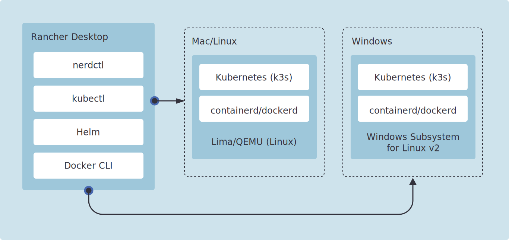
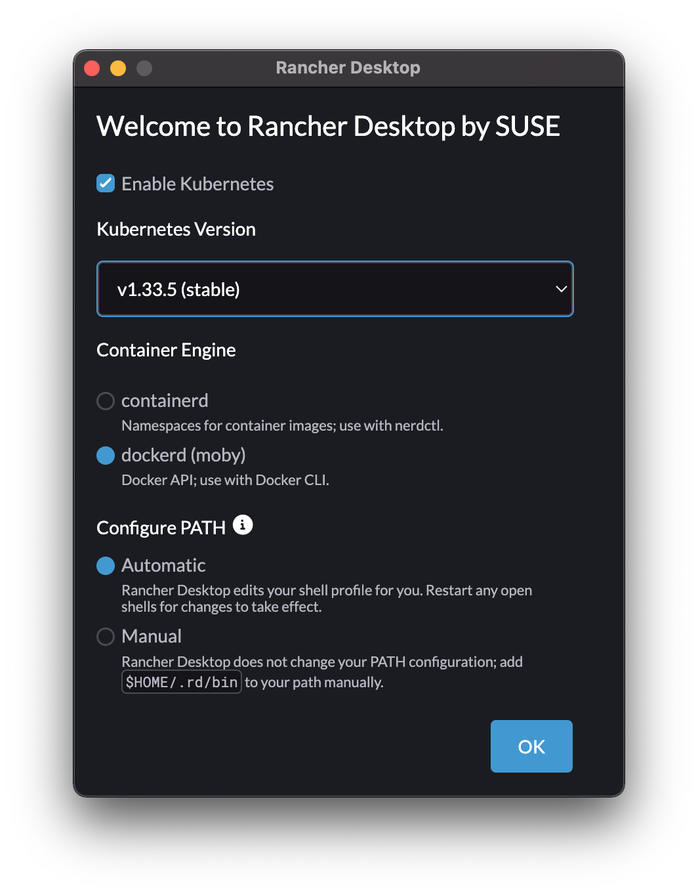

.. _rancher_desktop:

========================
Rancher Desktop
========================

Rancher Desktop 是 SUSE推出的 ``Rancher`` 桌面软件，跨平台为 :ref:`macos` (基于 :ref:`lima` )， :ref:`windows` 和 :ref:`linux` 桌面提供了容器和 :ref:`kubernetes` 管理，是开发者的基础工具 

我在 :ref:`lima_run_alpine` 遇到挫折，无法正常启动看似安装完成的 :ref:`alpine_linux` ，转念一想，在 :ref:`macos` 平台上，SUSE的 Racher Desktop 底层不就是基于 :ref:`lima` 么？并且lima的GitHub中， `alpine-lima: build Alpine based ISO images for lima <https://github.com/lima-vm/alpine-lima>`_ 正是用于构建一个用于 Rancher Desktop 底层Lima所使用的ISO镜像工具。

有商业公司支持的开源软件通常会更为易用一些，所以我尝试在Rancher Desktop中来运行 :ref:`alpine_linux`

Rancher Desktop 简介
=========================

和 :ref:`docker_desktop` 类似， Rancher Desktop 也是一个在桌面提供 :ref:`container` 管理和 :ref:`kubernetes` 的应用，并且跨平台在 :ref:`macos` , :ref:`windows` 和 :ref:`linux` 运行。

- 容器管理提供了构建、推送和拉取镜像的能力，不仅提供Docker CLI(可选择使用 :ref:`moby` 或 ``dockerd`` 作为引擎)，也可以使用 ``nerdctl`` (当选择 :ref:`containerd` 作为引擎)
- 在Rancher Desktop中通过 :ref:`k3s` 内建提供了 :ref:`kubernetes` ，方便开发者自由选择不同的Kubernetes版本以及重置Kubernetes环境，可以快速完成测试环境搭建

注意， ``Rancher Desktop`` 实际上和 ``Rancher`` 是不同的产品， ``Rancher`` 是用于管理 :ref:`kubernetes` 集群的解决方案，而 ``Rancher Desktop`` 仅仅是提供本地Kubernetes和容器管理的平台。所以，如果想要在本地运行 ``Rancher`` ，你需要在 ``Rancher Desktop`` 中独立安装 ``Rancher`` 。

.. note::

   我觉得 ``Rancher Desktop`` 的价值在于统一打包了常用的工具:

   - :ref:`lima`
   - :ref:`docker`
   - :ref:`nerdctl`
   - :ref:`kubectl`
   - :ref:`helm`
   - :ref:`k3s`

   以及一系列容器工具链，并且简化了升级工作。此外，内置Kubernetes使得开发专注于业务和工具开发，而不是底层架构永无止境的部署优化。

Rancher Desktop 工作原理
=========================

Rancher Desktop实际上是一个Electron程序，包装了一系列开源工具来提供易用的用户体院。在 :ref:`macos` 和 :ref:`linux` 平台，Rancher Desktop使用与你寄来运行 :ref:`containerd` 或 :ref:`docker` 以及 :ref:`kubernetes` 。而在 :ref:`windows` 平台则调用Windows Subsystem for Linux v2。

首次启动
=========

首次启动 Rancher Desktop 会提供一些默认常用配置(激活 :ref:`kubernetes` ，使用 :ref:`docker` 引擎):

版本运行要求
--------------

这里我遇到一个启动报错，原因是:

.. literalinclude:: rancher_desktop/download_error
   :caption: 下载镜像报错

下载镜像报错，可以看到 ``qemu-img`` 是针对 :ref:`macos` 13编译的，看起来我的操作系统 Big Sur 11 不满足要求

参考 `Rancher Desktop Installation <https://docs.rancherdesktop.io/getting-started/installation>`_ ，果然看到要求 **macOS 13 (Ventura) or higher** (从 1.18 开始)

根据 `Rancher Desktop 1.17 Installation <https://docs.rancherdesktop.io/1.17/getting-started/installation>`_ 可以看到回退到 ``1.17`` 版本可以在 **macOS Catalina 10.15 or higher** 上运行

所以我卸载1.20，重新安装 ``1.17``

``1.17`` 启动报错一
----------------------

由于之前安装了 ``1.20`` 配置了启动 kubernetes 1.3x 启动，但是回退到 ``1.17`` 之后配置残留，所以启动时会报错:

.. literalinclude:: rancher_desktop/start_k8s_error
   :caption: 启动 kubernetes 报错
   :emphasize-lines: 9

既然升级Rancher Desktop是不可能的，就只有 ``reset Kubernetes and container images`` 了(需要执行 **factory reset** ): 

- 在 Rancher Desktop 中，访问 ``Troubleshooting``
- 点击 ``Factory Reset`` 按钮

这个步骤会清理掉Kubernetes集群以及已经下载的镜像，整个Rancher Desktop会退出。再次启动Rancher Desktop之后，会重新引导进行一次配置

``1.17`` 启动报错二
----------------------

没有想到实际上 ``1.17`` 携带的 :ref:`qemu` 依然是针对 macOS 13 编译的，我回退到 ``Rancher Desktop 1.17`` 之后启动依然报错，检查发现在 ``/Applications/Rancher\ Desktop.app/Contents/Resources/resources/darwin/lima/bin/`` 目录下的 ``qemu-img`` 和 ``qemu-system-x86_64`` 都是相同提示:

.. literalinclude:: rancher_desktop/version_error
   :caption: ``qemu`` 相关程序都是针对macOS 13编译的二进制
   :emphasize-lines: 2,8

唉，这发行版搞得有点粗糙...

我突然后悔之前 ``uninstall`` 了 :ref:`macports` 编译的 :ref:`qemu` 了

好吧，我自己重新搞一次 :ref:`macports_old_qemu` ，然后再复制过来 ``qemu-img`` 和 ``qemu-system-x86_64``  

果然解决了启动问题，能够正常启动 ``qemu-system-x86_64``

参考
======

- `rancherdesktop.io <https://rancherdesktop.io/>`_
- `Rancher Desktop docs: Getting Started >> Introduction <https://docs.rancherdesktop.io/>`_
