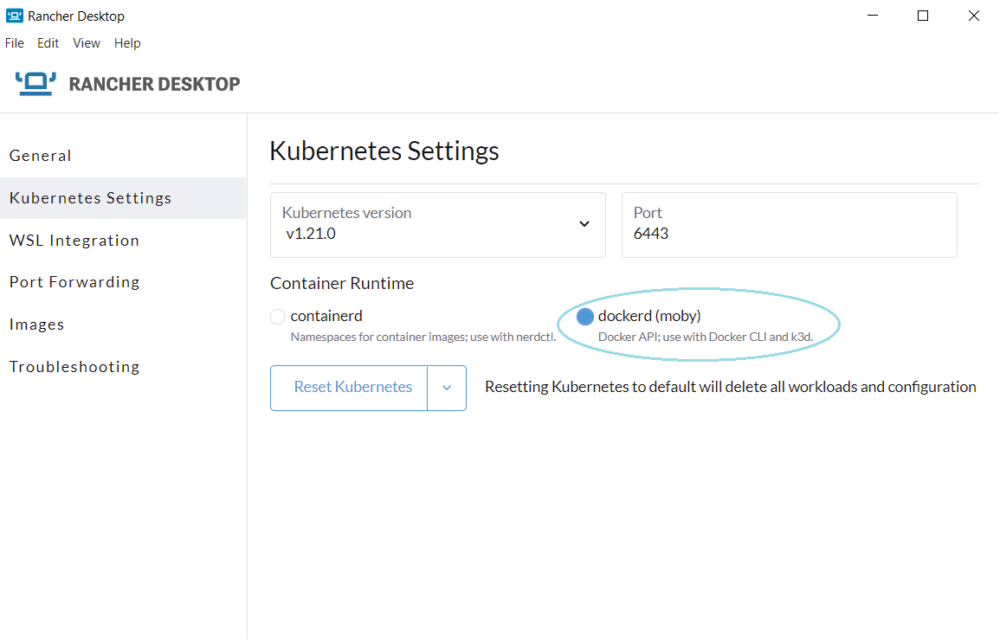
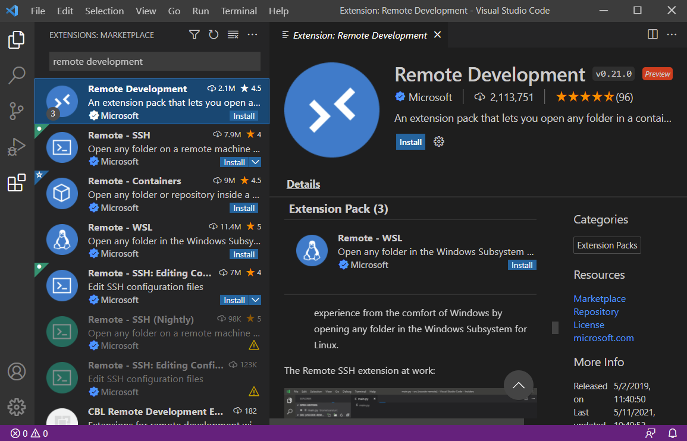
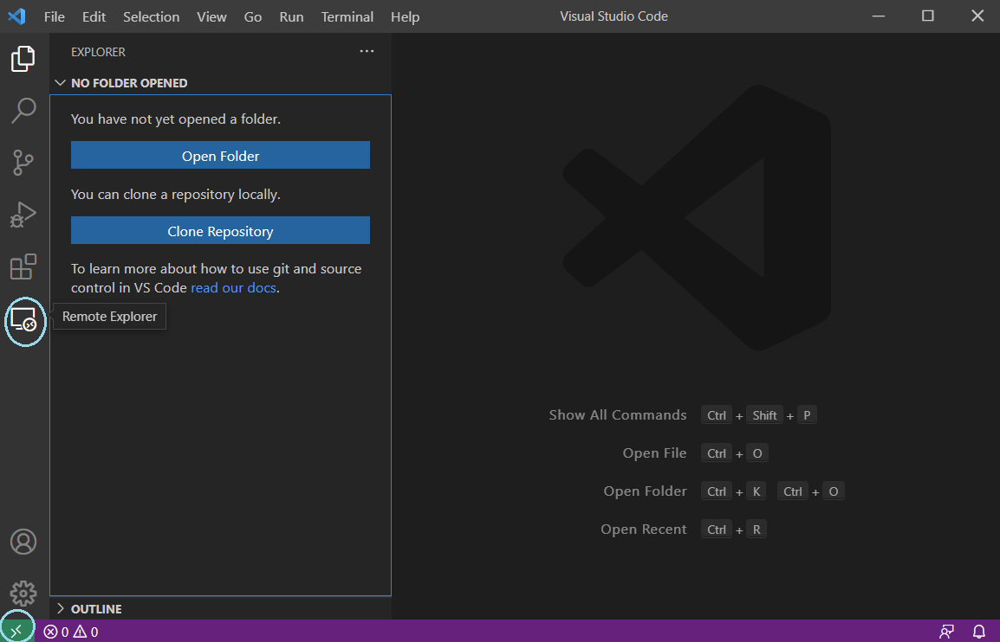
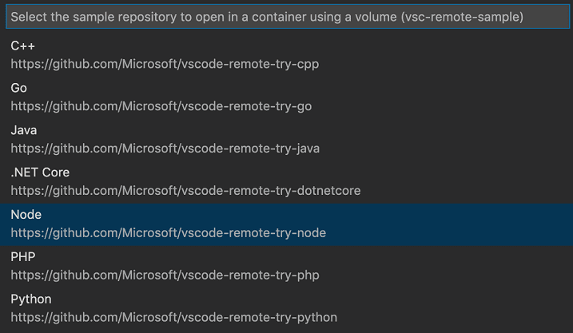
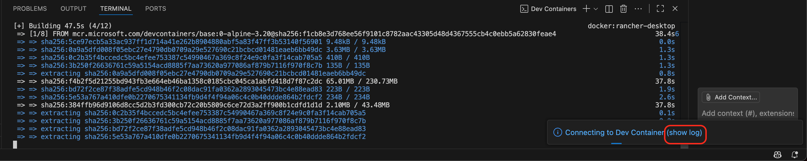
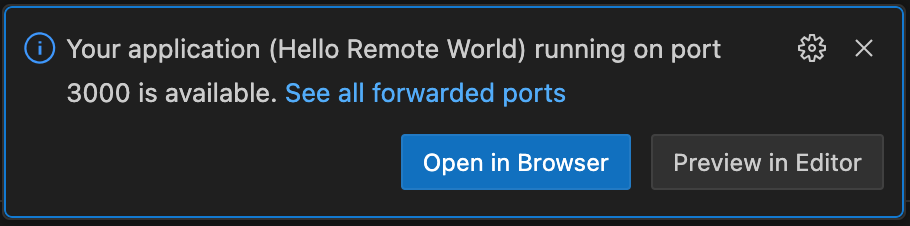
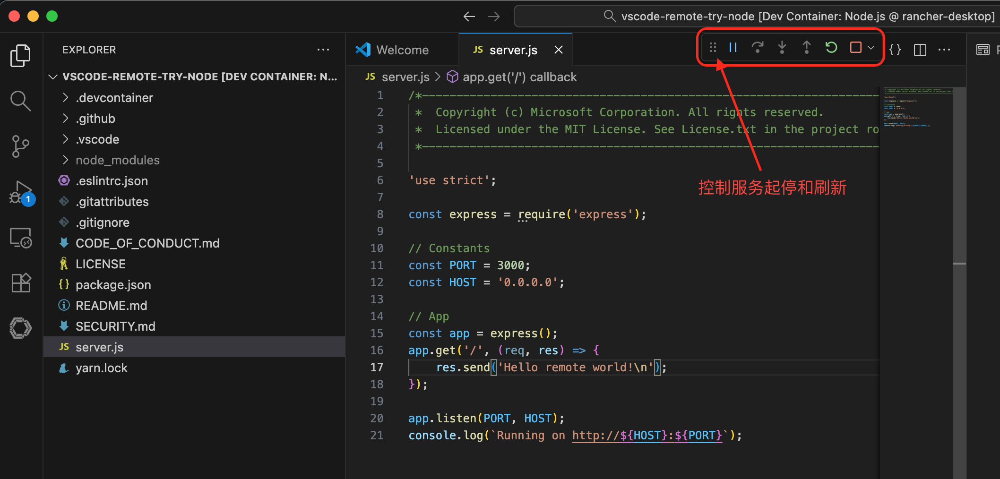
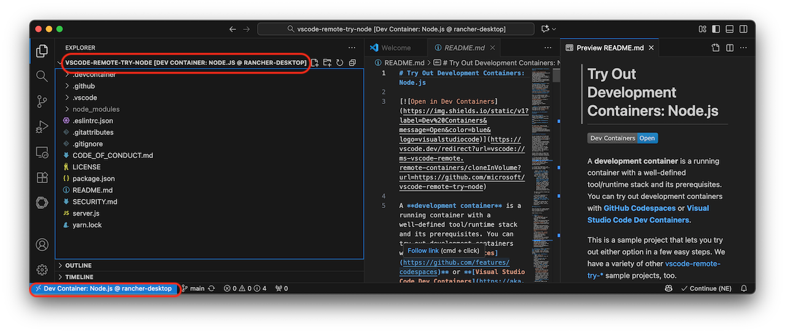

.. _rancher_desktop_vs_code_remote_containers:

=============================================================
在Rancher Desktop中使用Visual Studio Code Remote Containers
=============================================================

`Visual Studio Code Remote - Containers <https://marketplace.visualstudio.com/items?itemName=ms-vscode-remote.remote-containers>`_ 扩展可以使用Docker容器作为全功能开发环境。在Rancher Desktop通过 :ref:`moby` 支持Docker CLI，也就开箱即用地只吃了该插件。

- 首先确保Rancher Desktop使用 ``dockerd (moby)`` 作为Container Runtime(设置位于 ``Kubernetes Settings`` 菜单):

- 在 :ref:`vscode` 中安装 ``Remote Development`` 扩展包

在安装了 ``Remote Development`` 扩展包，会在左方看到 ``Remote Development`` 相关命令按钮:

.. note::

   `Rancher Desktop How-to Guides: VS Code Remote Containers <https://docs.rancherdesktop.io/how-to-guides/vs-code-remote-containers>`_ 原文中提供的安装 `vscode-dev-containers <https://github.com/microsoft/vscode-dev-containers>`_ 方法现在已经被微软废弃。

- 访问 `VS Code Dev Containers <https://marketplace.visualstudio.com/items?itemName=ms-vscode-remote.remote-containers>`_ 安装，或者直接在 :ref:`vscode` 中搜索 ``Dev Containers`` 插件安装

- 在 ``Dev Containers`` 插件安装完成后，在 :ref:`vscode` 中按下 ``F1`` ，然后运行命令 ``Dev Containers: Try a Dev Container Sample...`` 此时会出现一系列已经配置好的容器案例(远程开发用途)，包含了常见的语言

这里选择 ``Node`` 案例

- 此时VS Code就会调用系统配置好的docker环境来构建容器，在右下方点击 ``Connecting to Dev Container (show log)`` 能够看到后台正在pull镜像并在镜像下载完成后启动一个完整的开发容器

.. note::

   有关Nodes Dev Container详情可以参考 `vscode-remote-try-node <https://github.com/Microsoft/vscode-remote-try-node>`_ ，README有详细说明

使用
=======

如果你只想快速启动开发，那么只需要按下 ``F5`` (运行)就可以，此时会在远程容器中启动 :ref:`nodejs` 服务，经过短暂的编译之后，你会看到 :ref:`vscode` 提示你应用已经就绪在 ``3000`` 端口，可以通过浏览器访问

并且在 ``DEBUG CONSOLE`` 中显示

.. literalinclude:: rancher_desktop_vs_code_remote_containers/node_run
   :caption: 运行

此时使用浏览器访问 http://127.0.0.1:3000 就可以看到一个初始化的 :ref:`nodejs` 页面，虽然简陋，但是已经建立起完整的开发流程

- 在 :ref:`vscode` ，可以通过案例最简单的 ``server.js`` 修订来一步步完成开发，并且通过控制工具栏实现 :ref:`nodejs` 服务端重启和刷新，以便能够快速看到自己的开发效果:

Under the hool
===============

- 在完成上述 ``vscode-remote-try-node`` 部署之后，执行 ``docker ps`` 可以看到系统新增加了一个容器:

.. literalinclude:: rancher_desktop_vs_code_remote_containers/node_container
   :caption: 新增node运行容器

- 在本地 :ref:`vscode` 可以浏览远程容器(当然这里是连接 ``Rancher Desktop`` 中运行的一个容器)的案例代码，也即是说完全可以将容器迁移到不同服务器上方便远程开发:

- 进入 ``dev container`` 容器检查可以看到这个容器操作系统是比较古老的 Debian 11 (bullseye):

.. literalinclude:: rancher_desktop_vs_code_remote_containers/docker_shell
   :caption: 进入容器

检查容器情况

.. literalinclude:: rancher_desktop_vs_code_remote_containers/docker_shell_output
   :caption: 容器情况检查
   :emphasize-lines: 1,11

参考
======

- `Rancher Desktop How-to Guides: VS Code Remote Containers <https://docs.rancherdesktop.io/how-to-guides/vs-code-remote-containers>`_
- `Dev Containers tutorial <https://code.visualstudio.com/docs/devcontainers/tutorial>`_
