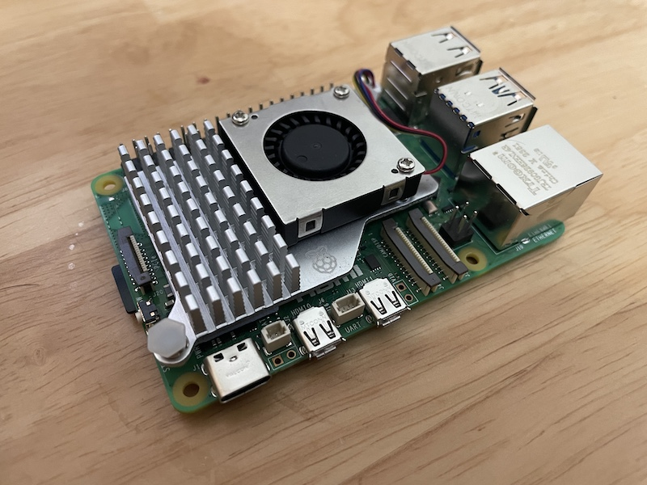

.. _pi_5_active_cooler:

===================
树莓派5主动散热器
===================

.. note::

   在树莓派配件中，我觉得最重要的配件是 电源 和 散热风扇 ，对系统稳定性有关键作用，建议购买官方配件。

对于树莓派，如果是idle状态下， :ref:`pi_4` 和 :ref:`pi_5` 的功耗相同，但是典型负载之下，则 :ref:`pi_5` 的功耗要大于 :ref:`pi_4` 的负载，所以 :ref:`pi_5` 一定要配备合适的散热器。

持续高负载意味着主板可能会进入节流状态(thermal throttling)，也就是软件控制限制CPU速度。好消息是，即使完全节流， :ref:`pi_5` 的运行速度依然比 :ref:`pi_4` 快!

树莓派官方为 :ref:`pi_5` 配套了一个 `Raspberry Pi Active Cooler <https://www.raspberrypi.com/products/active-cooler/>`_ 我购买使用觉得非常值得:

- 铝合金散热器，非常轻
- 铝合金表面阳极化处理，所以看起来非常美观
- 根据温度会自动调节转速:

  - 低于50°C，风扇不转(0%速度)
  - 50°C，风扇低速旋转(30%速度)
  - 60°C，风扇中速旋转(50%速度)
  - 67.5°C，风扇高速旋转(70%速度)
  - 75°C，风扇全速旋转(100%速度)

- 散热器铝合金散热片下已经贴了不同厚度的散热硅胶垫，可以完美贴合不同高度的主板芯片进行导热，所以不用自己手工搞散热垫(也很难把握厚度)
- 使用弹性卡扣卡住散热器，安装非常简便(但是不知道长期使用以后是否存在弹性衰退或脆断导致散热接触不良)

   Raspberry Pi Active Cooler

树莓派检测温度的方法
=====================

树莓派使用 ``vcgencmd`` 命令来获取系统信息，通过 `Python binding for RaspberryPi vcgencmd command-line tool <https://pypi.org/project/vcgencmd/>`_ 能够监控系统:

.. literalinclude:: pi_5_active_cooler/temperature.py
   :language: python
   :caption: ``temperature.py`` 获取当前系统的温度和主频

然后安装工具 ``stress`` 来模拟压力:

.. literalinclude:: pi_5_active_cooler/stress
   :language: bash
   :caption: 安装 ``stress`` 工具模拟压力

观察下来，没有工作负载时候 :ref:`pi_5` 温度大约47度，施加压力后工作温度大约65度上下。总之，使用了 ``Raspberry Pi Active Cooler`` 确实效果显著:

- 没有负载或者低负载情况下，散热风扇完全不转，完全静音
- 在室温30度以下，CPU全速运行时温度可以压制到65-70度，此时风扇50%转速，声音很小，没有第三方杂牌的风扇啸叫声

总之，一分钱一分货，你值得拥有

参考
======

- `Raspberry Pi 5 Active Fan not working <https://forums.raspberrypi.com/viewtopic.php?t=361957>`_
- `Heating and cooling Raspberry Pi 5 <https://www.raspberrypi.com/news/heating-and-cooling-raspberry-pi-5/>`_
