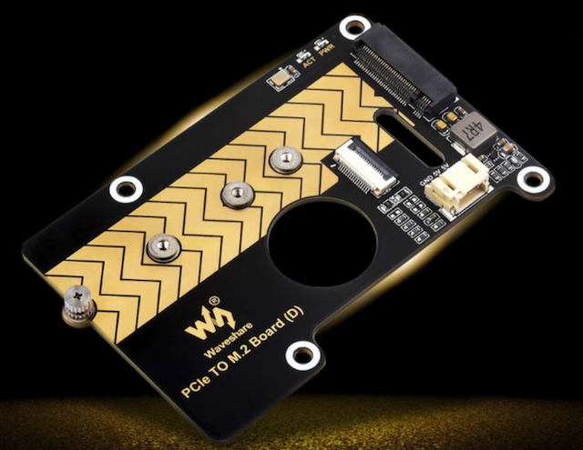
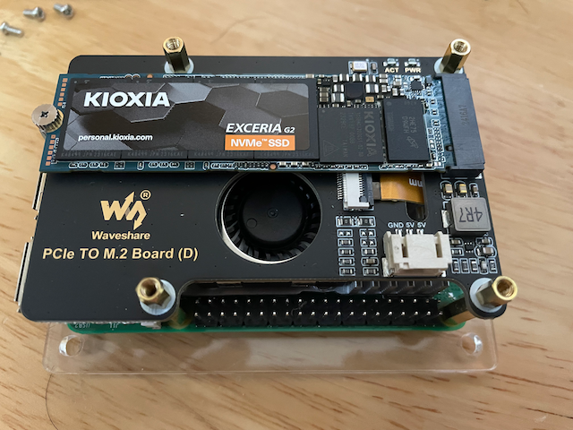

.. _pi_5_pcie_m.2_ssd:

================================
树莓派5 PCIe转M.2 NVMe SSD存储
================================

经过一天的资料查询和淘宝对比，我最终选择了以下 :ref:`pi_5_pcie` 存储解决组合:

- ``微雪电子 树莓派5 PCIe转M.2转接板 D型``

   微雪电子 树莓派5 PCIe转M.2转接板 D型

- :ref:`kioxia_exceria_g2` :

.. figure:: ../../_static/linux/storage/nvme/exceria-nvme-ssd_img_prd001.png

   铠侠KIOXIA EXCERIA NVMe SSD存储

组装
=====

   装配完成后的使用M.2 NVMe SSD存储的树莓派5(nvme存储下面是 :ref:`pi_5_active_cooler` )

软件配置
===========

:ref:`pi_5_pcie_3_m.2_ssd`
