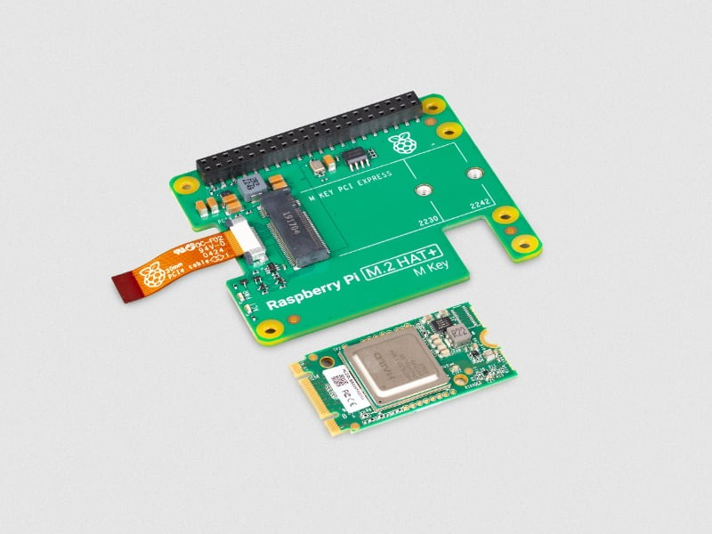

.. _pi_ai_kit:

===================
树莓派AI套件
===================

树莓派和 `hailo.ai <https://hailo.ai>`_ 公司合作开发了售价70美金扩展套件 AI Kit: 可将本地高性能、高能效推理集成到各种应用中，适用于 :ref:`pi_5`

   Hailo-8L M.2 AI 加速模块(13 TOPS)

参考
======

- `树莓派与 Hailo 合作推出 AI 套件，售价 70 美元 <https://shumeipai.nxez.com/2024/06/09/raspberry-pi-ai-kit-available-now-at-70.html>`_
- `树莓派官方: Raspberry Pi AI Kit <https://www.raspberrypi.com/products/ai-kit/>`_
