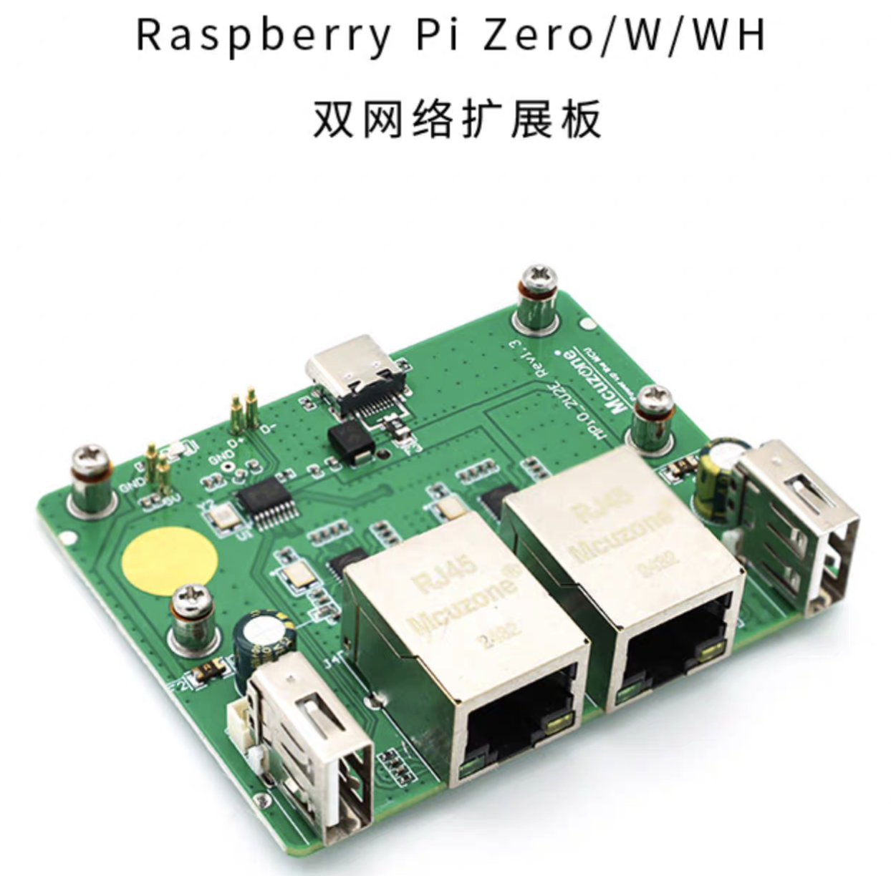
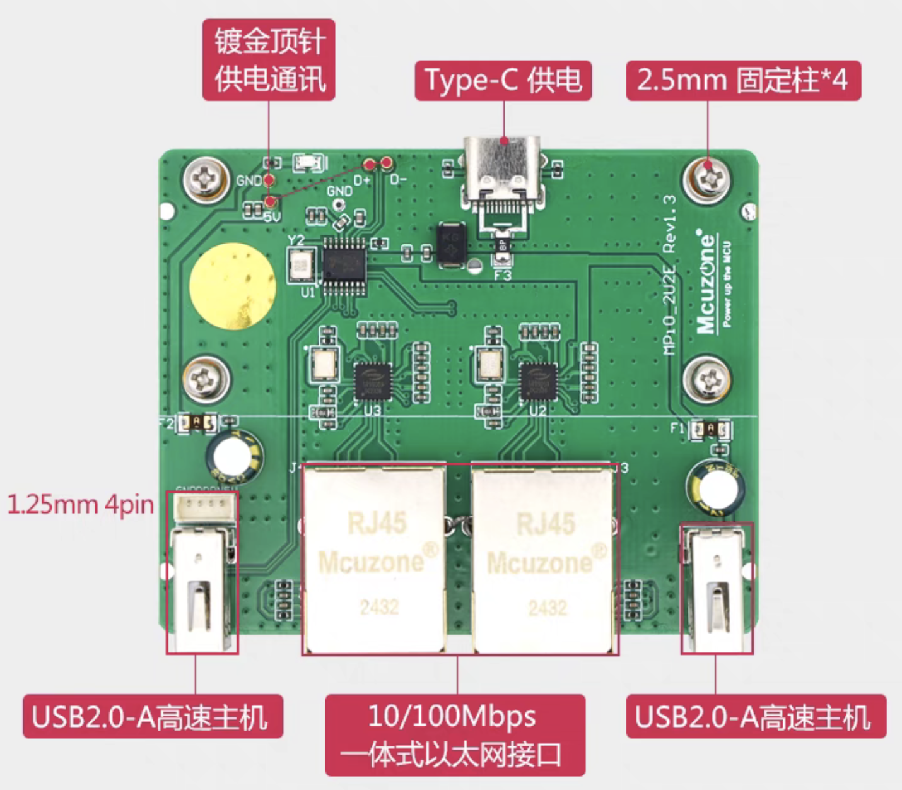

.. _pi_zero_net_ext:

==================================
树莓派Raspberry Pi Zero网络扩展板
==================================

我的二手服 :ref:`hpe_dl380_gen9` 由于安装位置原因，离有线网络接口有一段距离。最初我是通过一台笔记本有线网口连接桌面交换机访问服务器的网络和 :ref:`ipmi` 管理网口，然后通过转跳和NAT联通网络。但是这样非常笨重且占用一台笔记本设备，所以就考虑是否可以用树莓派来实现替代。

不过，目前没有使用的树莓派(有以太网接口)只有 :ref:`pi_1` ，但是树莓派一代是没有无线网络的，总不见得再搞个USB无线网卡吧。

偶然在淘宝上看到一个有趣的 :ref:`pi_zero` 双网络扩展板:

- 通过顶针将 :ref:`pi_zero` 的USB和电源连接到底板
- 底板通过USB HUB扩展以太网(有线网络)和标准USB Host主机接口(鼠标键盘介入)

装配
=======

- 到手的 ``双网络扩展板`` 和我的 :ref:`pi_zero`

.. figure:: ../../_static/raspberry_pi/hardware/pi_zero_net_ext.heic

- 轻松组装:

.. figure:: ../../_static/raspberry_pi/hardware/pi_zero_net_ext_combine.heic

- 配上外壳

使用
=======

- 安装 ``32位`` :ref:`pi_os`

- 有两个以太网接口，一个连接服务器的 iLO 管理接口，另一个连接服务器的第一个网络接口(ssh)
- 在 :ref:`pi_os` 中安装部署:

  - :ref:`ipmitool` 来管理 :ref:`hpe_dl380_gen9` 服务器重启和控制台
  - 启用NAT为 :ref:`hpe_dl380_gen9` 服务器上的 ``zcloud`` 提供网络通讯

