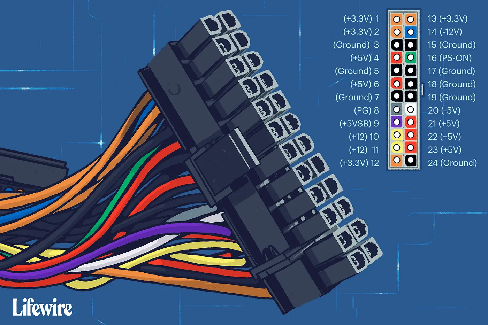

.. _pi_egpu_ml_arch:

================================
树莓派外接GPU实现机器学习架构
================================

之前购买的 :ref:`tesla_p10` 安装在二手 :ref:`hpe_dl380_gen9` 上使用，用于 :ref:`deepseek` 推理。这种IDE数据中心的服务器有一个很大的缺点就是耗电和噪音，对于家用环境非常不友好，所以我不得不每天晚上关机，白天使用时再开机。

然而我想到之前构思的 :ref:`pi_cluster` ，期望在低功耗情况下运行模拟集群，有没有可能结合树莓派来使用 :ref:`nvidia_gpu` ，这样可以7x24小时开机，随时可用的机器学习环境。

我在淘宝上看到过 ``QCULink`` 设备外接eGPU(另一种是用于苹果的 :ref:`thunderbolt` eGPU)，发现这种外接方案其实也可以用于 :ref:`pi_5` ，因为唯一的要求是具备 :ref:`pcie` 的 :ref:`m2` ，这个条件 :ref:`pi_5` 是满足的。

我考虑过低功耗的 :ref:`egpu_tesla_p4` 和，但是利旧自己的 :ref:`tesla_p10` 最终采用了缓和模式:

- :ref:`pi_cluster` 使用 :ref:`pi_5_pcie_4_m.2_ssd` 转接卡可以使用 ``QCULink``
- 购买了一个mini的ITX机箱进行改造，容纳下:

  - ``3个`` :ref:`pi_5` + ``3个`` :ref:`pi_4` + ``3个`` :ref:`pi_3` 构建的 :ref:`pi_cluster`
  - 通过 ``QCULink`` 将 :ref:`pi_5` 的一个 ``m.2`` 接口转接PCIe连接外挂的 :ref:`tesla_p4`
  - ITX主板安装一个低功耗 x86 主机(通过软PCIe连接线外挂 :ref:`tesla_p10` )

也就是说，最终我的运行架构会具备两个 :ref:`nvidia_gpu` 分别用于训练( :ref:`tesla_p10` )和推理( :ref:`tesla_p4` )

电源
=========

考虑到稳定性和功耗，我最终大出血购买了一个750W金牌PC机电源:

- 需要注意，如果不使用主板直接连接PC机电源和外接eGPU卡，则电源的主板连线需要跳线(相当于开关)才能输出电能:

  - 将24-pin电源电缆的第4和第5pin连接，就能直接驱动PC电源输出电能
  - 先开启PC电源(PSU)，等到电源和GPU都开始加电运行之后，再开启树莓派电源，这样树莓派启动后才能识别出外接eGPU

.. note::

   `Run LLM on Pi5: Connecting an NVIDIA GPU to Raspberry Pi 5 via PCIe x4 <https://alican-kiraz1.medium.com/run-llm-on-pi5-connecting-an-nvidia-gpu-to-raspberry-pi-5-via-pcie-x4-a6d52c3efd2a>`_ 提到了使用一个 `egpu-switcher <https://github.com/hertg/egpu-switcher/>`_ 来切换eGPU，待实践
   

参考
======

- `Run LLM on Pi5: Connecting an NVIDIA GPU to Raspberry Pi 5 via PCIe x4 <https://alican-kiraz1.medium.com/run-llm-on-pi5-connecting-an-nvidia-gpu-to-raspberry-pi-5-via-pcie-x4-a6d52c3efd2a>`_
- `External GPUs working on the Raspberry Pi 5 <https://www.jeffgeerling.com/blog/2023/external-gpus-working-on-raspberry-pi-5>`_
