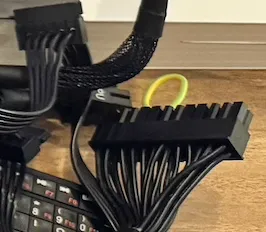
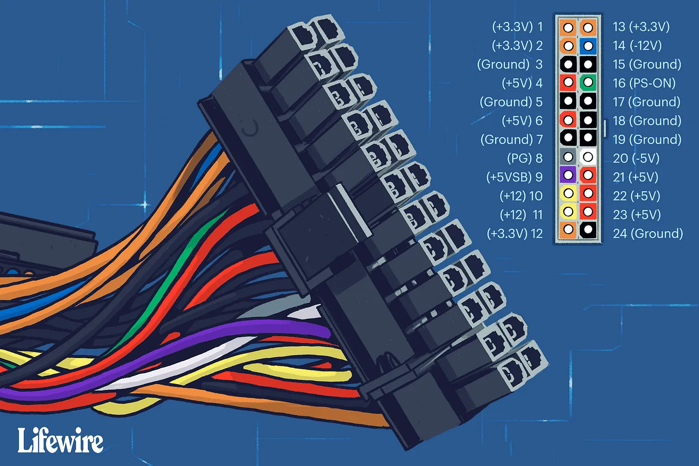

.. _pi_egpu_ml_arch:

================================
树莓派外接GPU实现机器学习架构
================================

之前购买的 :ref:`tesla_p10` 安装在二手 :ref:`hpe_dl380_gen9` 上使用，用于 :ref:`deepseek` 推理。这种IDE数据中心的服务器有一个很大的缺点就是耗电和噪音，对于家用环境非常不友好，所以我不得不每天晚上关机，白天使用时再开机。

然而我想到之前构思的 :ref:`pi_cluster` ，期望在低功耗情况下运行模拟集群，有没有可能结合树莓派来使用 :ref:`nvidia_gpu` ，这样可以7x24小时开机，随时可用的机器学习环境。

我在淘宝上看到过 ``QCULink`` 设备外接eGPU(另一种是用于苹果的 :ref:`thunderbolt` eGPU)，发现这种外接方案其实也可以用于 :ref:`pi_5` ，因为唯一的要求是具备 :ref:`pcie` 的 :ref:`m2` ，这个条件 :ref:`pi_5` 是满足的。

我考虑过低功耗的 :ref:`egpu_tesla_p4` 和，但是利旧自己的 :ref:`tesla_p10` 最终采用了缓和模式:

- :ref:`pi_cluster` 使用 :ref:`pi_5_pcie_4_m.2_ssd` 转接卡可以使用 ``QCULink``
- 购买了一个mini的ITX机箱进行改造，容纳下:

  - ``3个`` :ref:`pi_5` + ``3个`` :ref:`pi_4` + ``3个`` :ref:`pi_3` 构建的 :ref:`pi_cluster`
  - 通过 ``QCULink`` 将 :ref:`pi_5` 的一个 ``m.2`` 接口转接PCIe连接外挂的 :ref:`tesla_p4`
  - ITX主板安装一个低功耗 x86 主机(通过软PCIe连接线外挂 :ref:`tesla_p10` )

也就是说，最终我的运行架构会具备两个 :ref:`nvidia_gpu` 分别用于训练( :ref:`tesla_p10` )和推理( :ref:`tesla_p4` )

电源
=========

eGPU PC主机电源
-----------------

考虑到稳定性和功耗，我最终大出血购买了一个750W金牌PC机电源:

- 需要注意，如果不使用主板直接连接PC机电源和外接eGPU卡，则电源的主板连线需要跳线(相当于开关)才能输出电能:

  - 将24-pin电源电缆的第4和第5pin连接，就能直接驱动PC电源输出电能
  - 先开启PC电源(PSU)，等到电源和GPU都开始加电运行之后，再开启树莓派电源，这样树莓派启动后才能识别出外接eGPU

.. note::

   `Run LLM on Pi5: Connecting an NVIDIA GPU to Raspberry Pi 5 via PCIe x4 <https://alican-kiraz1.medium.com/run-llm-on-pi5-connecting-an-nvidia-gpu-to-raspberry-pi-5-via-pcie-x4-a6d52c3efd2a>`_ 提到了使用一个 `egpu-switcher <https://github.com/hertg/egpu-switcher/>`_ 来切换eGPU，待实践

.. _egpu_server_power:

eGPU服务器电源
-----------------

万能淘宝提供了一个更好的选择，使用转换模块可以将 :ref:`hpe_dl380_gen9` 标准服务器电源改造成eGPU外接电源。而且电源模块通过USB同步启动信号线，能够在PC主机启动时自动触发电源模块供电，从而实现外接eGPU和PC主机同时启动。

不过，gemini提示HP DL380 Gen9电源有一些特殊，并非标准CRPS电源，而是HPE自己的设计规范，称为 HPE Common slot Power Supplies:

- 物理兼容性：它的金手指（插槽接口）布局与通用标准的 CRPS 非常相似，但 HPE 往往在金手指的 **针脚定义（Pinout）** 上做了一些改动（特别是用于电源管理、I2C 通讯的信号针脚）。
- 通信协议：HPE 的电源使用特定的固件与服务器主板通讯（如实时功耗监测）。如果使用通用的 CRPS 转接板，可能会遇到无法启动或无法同步开关机的问题。

Gemini建议购买 “直出 12V” 转接板(Breakout Board): 这种专门针对Gen9/Gen10的转接板通常只提供多个 6+2 Pin 的显卡接口:

- 优势: 由于只走大电流12V，不涉及复杂的ATX信号协议转换，极其稳定
- 联动启动：选择带"同步启动口"的转接板，这种转接板可以通过一根4-pin或SATA线转接线连接到PC台式机电源上，这样PC台式机通电后，会给转接板一个高电平信号，唤醒HP电源

我在淘宝上找到一种20元左右的只提供手动拨动开关的服务器电源6-pin转接板，实际上是矿机使用的电源板，能够将服务器电源输出给GPU使用。不过这种廉价转接板只是单纯的物理连接，缺乏足够的滤波电容，如果运行AI模型电流剧烈波动，可能会产生电磁噪音，干扰周边的显卡或NVMe硬盘。

另外，需要注意转接板只有 ``6-pin`` 输出，需要购买质量较好的 ``6-pin`` 转 ``8-pin`` 电源线，并且导线必须足够粗(18AWG或更粗，注意数字越小越粗，例如16AWG线材更好)。

.. note::

   电源线8-pin中比6-pin多的2pin实际上GND(地线)，这多出的2根地线提供了不同的功能:

   - Sense(感知)信号: 当显卡检测到这个针脚接地时才表明能使用150W电流
   - 额外的地线回路: 增加电流的回流能力

   6pin接口理论承载功率是75W，而8pin接口理论承载功率是150W

   :ref:`amd_radeon_instinct_mi50` 之所以使用了2个8pin的电源，表明这个GPU设计TDP是300W (150Wx2)

成本考虑以及其他
==================

考虑到要将 :ref:`amd_radeon_instinct_mi50` 安装到普通PC服务器上，实际上需要投入:

- "直出12V"转接板: 20元
- 16AWG线材的6pin转8pin显卡电源线: 80元(共4根)
- :ref:`amd_radeon_instinct_mi50` 散热改装: 120元(共2个带风扇散热壳)
- PCIe 4.0x16显卡延长线: 279元(我已经买了2根，需要再补一根，不过也可利旧以前的PCIe转接线，就是不太好看)

总之，大约至少需要投入220元

.. note::

   最大的犹豫是 "直出12V" 转接板质量是否满足这种大功率GPU的长期持续使用？

考虑到 Dell T5820 工作站，只需要1000元就能购买到准系统，提供了6个PCIe插槽，就无需这么折腾引出各种电源线和PCIe转接线，实际上性价比似乎更好。

.. warning::

   我暂时放弃了这个改造，实际上不管怎么折腾，拼凑起来的组装机都不如二手市场上购买的品牌服务器，因为只有大规模工业化生产的成品服务器才能综合得到最佳平衡。这点是我在反复折腾中得到的经验，除非你能投入2~3倍的资金来组装特定需求的服务器。

参考
======

- `Run LLM on Pi5: Connecting an NVIDIA GPU to Raspberry Pi 5 via PCIe x4 <https://alican-kiraz1.medium.com/run-llm-on-pi5-connecting-an-nvidia-gpu-to-raspberry-pi-5-via-pcie-x4-a6d52c3efd2a>`_
- `External GPUs working on the Raspberry Pi 5 <https://www.jeffgeerling.com/blog/2023/external-gpus-working-on-raspberry-pi-5>`_
