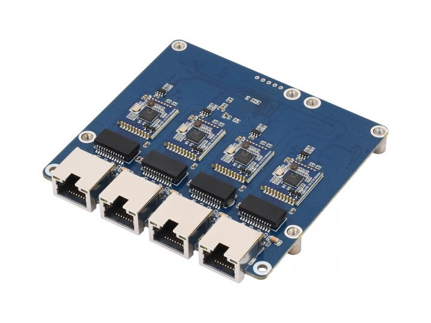

.. _pi5_pcie_to_4-ch_2.5g_eth_board:

=====================================
树莓派5 PCIe转4路2.5Gb以太网扩展板
=====================================

我一直想构建一个 :ref:`pi_cluster` ，虽然市场上已经出现了非常精巧 ``矽速科技`` 开发的 ``NanoCluster`` ，但是采用的是树莓派 Compute Module 4/5 组建，对于我已经投入数千元购买的 :ref:`pi_3` / :ref:`pi_4` / :ref:`pi_5` 无法匹配，所以我考虑如何在现有硬件情况下构建 :ref:`pi_cluster` :

- 3台1GB内存规格的 :ref:`pi_3`
- 2台8GB内存规格的 :ref:`pi_4` ，1台2GB内存规格的 :ref:`pi_4`
- 3台8GB内存规格的 :ref:`pi_5`

为了能够网络连接这9台树莓派设备，我曾经够买过小型桌面交换机。但是一方面外接网络设备不紧凑，另外一方面外接网络设备无法玩SDN，所以我一直有一个想法是采用树莓派自身作为交换机来互联，以便能够实现网络流量监控和分析，以及进行流量整形，实现一个类似 :ref:`mikrotik` 功能的自制交换机。

微雪有一款 `PCIE TO 4-CH 2.5G ETH Board (B) <https://www.waveshare.net/wiki/PCIE_TO_4-CH_2.5G_ETH_Board_(B)>`_ 比较符合我的要求(虽然端口有点少):

通过PCIe排线连接以后，为 :ref:`pi_5` 增加了4个独立的 2.5Gb 以太网接口

.. note::

   淘宝上还有一种采用 RTL8111H 芯片开发的PCIe扩展千兆以太网，虽然能够提供7个以太网网口，但是实际上是一个独立的千兆网交换芯片连接7个以太网口，在树莓派端只能看到一个 ``eth1`` ，对7个千兆以太网口没有控制能力，所以我没有选择。

配置
======

- 修订 ``/boot/firmware/config.txt`` ，启用PCIe接口

.. literalinclude:: pi5_pcie_to_4-ch_2.5g_eth_board/config.txt
   :caption: 修订 config.txt 启用PCIe

- 重启 :ref:`pi_5` 之后，可以识别到新增4个以太网口:
