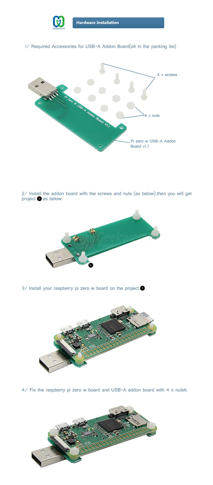
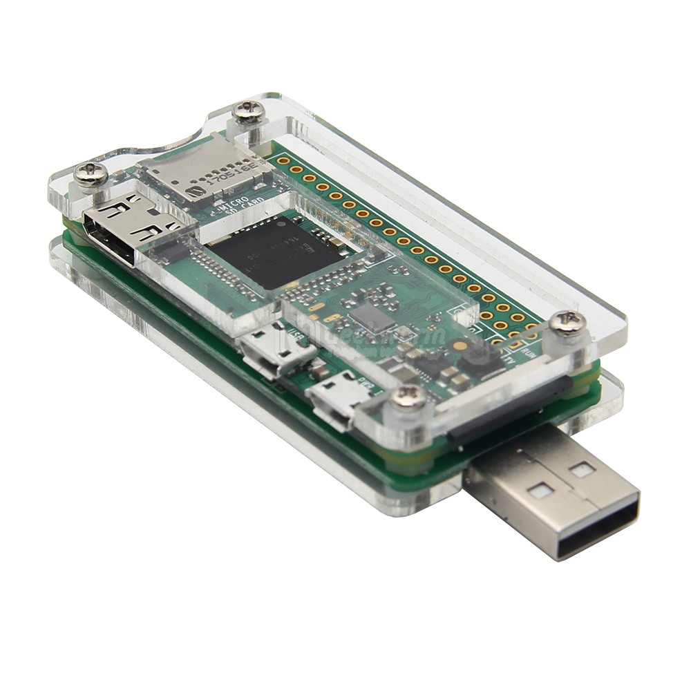

.. _pi_zero_net_gadget:

==========================================
树莓派Zero设置USB网络通讯(Ethernet Gadget)
==========================================

树莓派不同型号的各代产品提供了 :ref:`usb_gadget` 功能，通过将树莓派的USB接口配置为 **USB Gadget模式** (网络设备/虚拟网卡，即RNDIS或CDC-ECM)，直接用普通的USB数据线连接，就能在两台树莓派上各自识别出一个虚拟网卡( ``usb0`` )。

通过这个虚拟网卡，可以在USB线上跑全套的TCP/IP网络协议(包括 :ref:`ssh` HTTP MQTT ping 等)，完全能够替代传统的以太网线连接。

但是并不是所有树莓派的所有USB接口都能设置 :ref:`usb_gadget` :

- **Raspberry Pi Zero / Zero W / Zero 2 W** : 使用标记为 ``USB`` 的 Micro-USB 接口（非 PWR 供电口）
- **Raspberry Pi 4B / 5** : 使用原生的 ``Type-C`` **供电/数据接口** （带有 OTG/Gadget 功能）
- **Raspberry Pi A+ / 3A+** : 使用标准的 USB ``Type-A`` 接口（同样支持 OTG）

.. warning::

   :ref:`pi_5` 只有Type-C 口能跑 Gadget 模式:

   - **板载 4 个 Type-A 接口（蓝色/黑色）** 在硬件电路层面上 **仅支持 Host（主机）模式** ，无法作为 Gadget（从设备）模拟虚拟网卡: 
   - **线材质量（最关键）** : 如果使用的是普通手机充电线或廉价 Type-C 线，内芯通常只有 ``D+/D- 两根 USB 2.0`` 数据线，会自动降级到 ``300+ Mbps`` 的速率；只有换成标有 ``5Gbps/10Gbps`` 的 **全功能 Type-C 数据线** ，才能握手到 USB 3.0 速率。

.. warning::

   树莓派 Zero（包括 Zero W 和 Zero 2 W）配备了两个 Micro-USB 接口，它们在功能上有明确的分工:

   - **电源接口（PWR IN）** : 标有 ``PWR`` 或 ``PWR IN`` 的 Micro-USB 接口专门用于输入电源（5V供电）。
   - **数据接口（USB）** : 一个 Micro-USB 接口是 **USB 2.0 OTG** 数据口，用于连接鼠标、键盘、U盘等外设，或通过 USB Gadget 模式连接电脑。

Gadget 驱动协议
=====================

``CDC-ECM`` （以太网控制模型）和 ``CDC-NCM`` （网络控制模型）是标准的 USB 设备类，用于在 Linux USB 设备设计中通过 USB 连接模拟有线以太网适配器。

- ``CDC-ECM`` (Ethernet Control Model) 

  - 比较古老和简单的协议
  - 每次USB传输处理一个以太网帧
  - CPU开销较高，吞吐量效率较低
  - 对多种操作系统有广泛的兼容性

- ``CDC-NCM``  (Network Control Model) 

  - 现代的先进协议，为高速宽带优化
  - 支持帧聚合(将多个以太网数据包捆绑到单个USB传输中)
  - 显著提高吞吐量，降低延迟并提升能效
  - 在现代移动和嵌入设备(如 :ref:`android` )中取代了RNDIS等传统协议
  
.. warning::

   本文实践是早期完成的，没有对最新的 :ref:`usb_gadget` 协议 ``CDC-NCM`` 进行实践，所以性能优化有限。后续再找机会进行对比测试。

树莓派Zero专用的USB扩展板
==========================

``Ethernet Gadget`` 是一个可以用于树莓派通过 :ref:`usb_gadget` 线连接到主机的方法，可以实现网络，VNC，ssh以及scp等操作。

虽然名为 ``Ethernet Gadget`` ，实际上并不使用以太网线，而只需要使用USB micro-B连线连接主机和Raspberry Pi Zero。此时 ``Pi`` 就像一个以太网设备。

淘宝上有一种Raspberry pi zero专用的USB扩展板，可以直接将Zero转换成通过标准USB接口取电和同时通讯，方便了使用和携带：

加上一个透明的亚克力保护壳，非常美观：

配置Ethernet Gadget
====================

当网络连接后，可以通过USB线将主机的网络共享给 ``Pi`` 

- 首先 :ref:`pi_quick_start` 将系统安装好

- 编辑 ``config.txt`` ，在最后添加一行::

   dtoverlay=dwc2

- 编辑 ``cmdline.txt`` 在 ``rootwait`` 之后加上一个空格，以及 ``modules-load=dwc2,g_ether`` 。完整配置如下::

   dwc_otg.lpm_enable=0 console=serial0,115200 console=tty1 root=PARTUUID=5e878358-02 rootfstype=ext4 elevator=deadline fsck.repair=yes rootwait modules-load=dwc2,g_ether

- 激活树莓派的SSH登陆功能:

只要在 ``/boot`` 分区中有一个空白的 ``ssh`` 文件存在，树莓派 ``Raspbian`` 系统启动时候就会启动SSH服务。

- 将TF卡插入Raspberry Pi Zero设备，然后通过USB连接到主机上

此时Pi Zero会被识别成一个以太网设备。例如，在Mac已经支持了Bonjour（对于Linux系统，需要添加Bonjour支持），则立即看到网络设备。对于Windows主机，则需要添加Bonjour支持 `添加bonour zoneconf网络 <https://learn.adafruit.com/bonjour-zeroconf-networking-for-windows-and-linux/>`_ 

.. note::

   此时Raspberry Pi是动态IP地址，所以除非能够在你的Bonjour网络设备上启动DHCP服务，否则无法和对端通讯。

设置树莓派Zero静态IP
========================

将树莓派的TF卡通过转接套转成U盘，插入到可以识别EXT4文件系统的Linux主机上。然后在Linux主机上挂载TF卡的 ``/dev/sdX2`` 分区（这里 ``X`` 是指动态识别的磁盘设备编号，通常可能是 ``/dev/sdb2`` ） 

- 挂载树莓派分区::

   mount /dev/sdb2 /mnt

- 编辑挂载的TF卡分区 ``/dev/sdb2`` 上的Raspbian的配置文件。

编辑 ``/mnt/etc/network/interfaces`` 配置如下::

   allow-hotplug usb0
   iface usb0 inet static
           address 192.168.7.10
           netmask 255.255.255.0
           network 192.168.7.0
           broadcast 192.168.7.255
           gateway 192.168.7.1

- 另一种方式是编辑 ``/mnt/etc/dhcpcd.conf`` （这是当前推荐的方法） ::

   interface usb0
   static ip_address=192.168.7.10/24
   static routers=192.168.7.1
   static domain_name_servers=192.168.7.1

这样启动Raspberry Pi Zero就会自动将USB网卡配置固定IP地址。也就是可以在对应的主机上，将网卡IP配置成 ``192.168.7.1`` ，就可以和Pi Zero的IP ``192.168.7.10`` 互相通讯了。

参考
=======

- `Ethernet Gadget <https://learn.adafruit.com/turning-your-raspberry-pi-zero-into-a-usb-gadget/ethernet-gadget>`_
- `USB gadget mode in Raspberry Pi OS: SSH over USB <https://www.raspberrypi.com/news/usb-gadget-mode-in-raspberry-pi-os-ssh-over-usb/>`_ 2026年较新的介绍文章
- gemini
