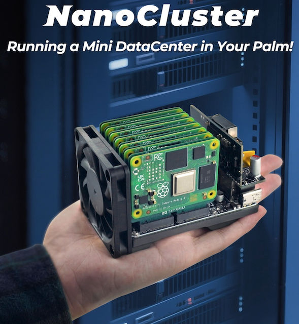

.. _pi_soft_storage_cluster:

=======================
树莓派软件定义存储集群
=======================

我构思的 :ref:`pi_storage_cluster` 需要大量的资金投入:

- :ref:`pi_5` 只支持 :ref:`pcie` gen2 和 gen3，这意味着我以前投入"巨资"购买的 :ref:`samsung_pm9a1` (pcie gen4)无法使用: 虽然旧版的nvme ssd m.2 存储现在降价，但是重新购买依然是失业的我无法承受之重
- 较为理想的方案是采用 ``3台`` :ref:`pi_5` 来构建分布式集群: 每个 :ref:`pi_5` 满配 ``4个`` nvme m.2 ssd gen3 存储(巨资); 其次是每个 :ref:`pi_5` 配置 ``1个`` nvme(依然可以组 :ref:`ceph` 只是容量缩减) 
- 受限于 :ref:`pi_5` 孱弱的pcie gen2存储接口(毕竟是经济型设备)，实际上投入巨资组建的存储集群只能说可用，但无法发挥 :ref:`nvme` 存储的全部性能(甚至只有很小一部分性能): 可以说性价比很低

既然我的Clous Atlas是一个模拟学习指南，那么尽可能少投入、尽可能多锻炼实践是我的终极目标，那么有没有可能用一个极为低廉的资金来实现一个功能齐全的 **软件模拟存储集群** 呢?

我的构思一
==============

- 在 :ref:`boot_on_zfs_for_raspberry_pi` 实现RAID1存储ZFS:

  - 只在 **一块NVMe存储** ( :ref:`kioxia_exceria_g2` ) 上用两个磁盘分区来模拟真正的物理磁盘，实现类似数据中心常用的RAID1，并模拟磁盘故障和恢复，验证是否可以持续稳定工作

- 虽然只有一台物理主机 :ref:`pi_5` ，但是通过 :ref:`kind` 可以实现完整的Kubernetes集群的部署、开发和测试

- 在 **一块NVMe存储** 上划分出 ``3个`` 磁盘分区，作为块设备映射到 :ref:`kind` 集群工作节点上，使用 :ref:`rook` 来实现一个模拟生产环境的 :ref:`ceph` 存储集群

- 在这个单机虚化模拟出来的Kubernetes集群中部署 :ref:`gitlab` ，所有容器的块存储都构建在分布式的 :ref:`ceph` 集群的 :ref:`ceph_rbd` 上:

  - 部署分布式 :ref:`pgsql` 

- 在Kubernetes集群部署NAS应用(云盘)，构建基于 :ref:`ceph` 后端的分布式文件服务器

- 集成 :ref:`hailo_ai` 加速器，尝试部署边缘AI

.. note::

   由于 :ref:`pi_5` 性能有限，完整部署的负载可能单台树莓派无法承担，必要时再购买1~2台 :ref:`pi_5` 进行横向扩展

我的构思二
============

进一步的想法是结合现有 :ref:`pi_4` 来构建一种物理和虚拟结合的集群:

- 我有 ``3个`` :ref:`pi_4` 作为 :ref:`kubernetes` 的控制平面(是的，原先我是作为工作节点，现在有了 :ref:`pi_5` 之后， :ref:`pi_4` 降级为控制，而 :ref:`pi_5` 作为计算节点)

  - 管控节点部署 :ref:`prometheus` / :ref:`grafana` 等监控

- 我 **又购置了一台** :ref:`pi_5` ，并且也添加了 **一块NVMe存储** ( :ref:`kioxia_exceria_g2` )

  - 一个 :ref:`pi_5` 划分2个分区，用来模拟 :ref:`zfs` 的 RAID1 ，部署 :ref:`boot_on_zfs_for_raspberry_pi` (注意，这会消耗双倍的存储空间)，所以我仅使用 (128G x2)
  - 一个 :ref:`pi_5` 使用传统的 :ref:`ext` 4 ，简单构建 :ref:`pi_5_nvme_boot` ，使用 128G (对应另外一个 :ref:`pi_5` )，然后再准备 128G EXT4文件系统(这个分区对应另一个 :ref:`pi_5` 的 :ref:`zfs` RAID1多消耗的冗余数据空间)，这个第二分区将作为 :ref:`zfs` 的实验室，也就是使用模拟块文件来测试ZFS的 RAIDZ
  - 两个 :ref:`pi_5` 都使用 256G 来构建一个 :ref:`docker_zfs_driver` (开启压缩)，实现容器镜像本地存储
  - 两个 :ref:`pi_5` 划分 1T 用于构建 :ref:`ceph` ，实现 :ref:`kubernetes` 云存储
  - 两个 :ref:`pi_5` 剩余 512G (实际不足) 用于构建 :ref:`gluster` ，作为日常数据冗余存储，也提供给 :ref:`kubernetes` 作为文件存储和离线存储

- :ref:`kubernetes` 集群主要容器镜像都存储在 :ref:`ceph` 云存储，仅对数据库容器存储采用本地存储(数据库有自己的容灾)

我的构思三
=====================

正如 :ref:`edge_cloud_infra_2024` 所述，我最终剁手了 ``3台`` :ref:`pi_5` :

- 考虑到性能以及扩展性 ( :ref:`pi_ai_kit` / :ref:`pi_5_pcie_m.2_ssd` )，我最终决定采用 :strike:`3台` ``4台`` :ref:`pi_5` 来构建模拟集群

  - 考虑到SSD磁盘宝贵(价格昂贵)，方案二中ZFS的RAID模拟测试我准备改为虚拟机模拟测试，以便随时回收测试资源避免磁盘空间浪费
  - 最初我安装 :ref:`raspberry_pi_os` 采用了精简的 :ref:`raspberry_pi_os_init` ，并且使用了 ``64GB`` TF卡安装。所以后续 :ref:`pi_5_nvme_boot` 继承了64GB的操作系统使用分区空间大小

    - 我认为对于稳定的服务器系统，64GB空间是足够的，后续数据存储将使用 :ref:`zfs` 构建，不会占用基础OS磁盘分区空间

  - :ref:`ceph` 使用 1T 存储
  - :ref:`pi_5_nvme_zfs` 使用剩余存储空间，采用一个 ``zpool-data`` 来构建 :ref:`pi_5_nvme_zfs`

.. csv-table:: 树莓派5模拟集群NVMe存储分区
   :file: pi_soft_storage_cluster/parted.csv
   :widths: 5, 15, 20, 30, 30
   :header-rows: 1

我的构思四
============

- 继续使用 :ref:`pi_3` / :ref:`pi_4` / :ref:`pi_5` 设备 构建集群，但是存储从树莓派抽离，主要集中安装到我组装的 :ref:`nasse_c246` 桌面主机
- 通过 :ref:`freebsd` 的 :ref:`zfs` 构建 ``RAIDZ0`` 存储数据，虽然没有任何数据冗余，但是4个 :ref:`kioxia_exceria_g2` 构建高性能大容量存储
- 通过 :ref:`bhyve` 运行 FreeBSD 虚拟机，来构建3个节点的 :ref:`ceph` 分布存储
- 使用软交换方式( :ref:`nasse_c246` 提供了4个 2.5G 网络)，实现 :ref:`pi_5` 高速访问存储，来构建一个使用 :ref:`ceph` 存储的 :ref:`kubernetes` 集群

业界的产品化集群
==================

随着树莓派生态完善，涌现了不同的集群构建硬件。其中使用 :ref:`pi_cm4` (BCM2711) 和 :ref:`pi_5` 计算模块 (BCM2712) 构建的微型集群，非常有特色。2025年6月6日，看到油管博主Jeff Geerling介绍的 `Cute, but powerful: meet NanoCluster, a tiny supercomputer <https://www.youtube.com/watch?v=UEtpaiODNs0>`_ ，也就是 ``硅速科技`` 正在预售的 `Sipeed NanoCluster <https://sipeed.com/nanocluster>`_ :

- 以一个可乐罐大小的体积提供 ``7个`` :ref:`pi_cm4` (BCM2711) 或 :ref:`pi_5` 计算模块 (BCM2712)构建的高性能树莓派集群
- 底部采用一个Open SDK for RISC-V GbE交换机互联
- 第一个slot的树莓派可以管理所有slot的电源，以及支持4个slot的 :ref:`pi_uart` ，非常类似服务器的 :ref:`hp_ilo` 管理(虽然比较简陋)
- 支持POE电源简化连线，也支持60W PD
- 最高支持7个SOMs，如果使用7个 :ref:`pi_5` 计算模块 (BCM2712) 可以获得 56 CPU核心，126TOPS 计算能力(可能还达不到NVIDIA Jetson 256TOPS能力) (此处采用产品宣发资料，未验证)

  - 7个SOM组合包售价 ``250$``

.. note::

   这是一个有意思的产品，非常吸引人。不过我已经购买了大量的 :ref:`pi_3` / :ref:`pi_4` / :ref:`pi_5` 设备，所以不太可能再购买。不过我的树莓派集群虽然达不到这么紧凑，但是功能和软件能力上并不弱，我将用软件定义方式来实现复杂的云计算平台。
