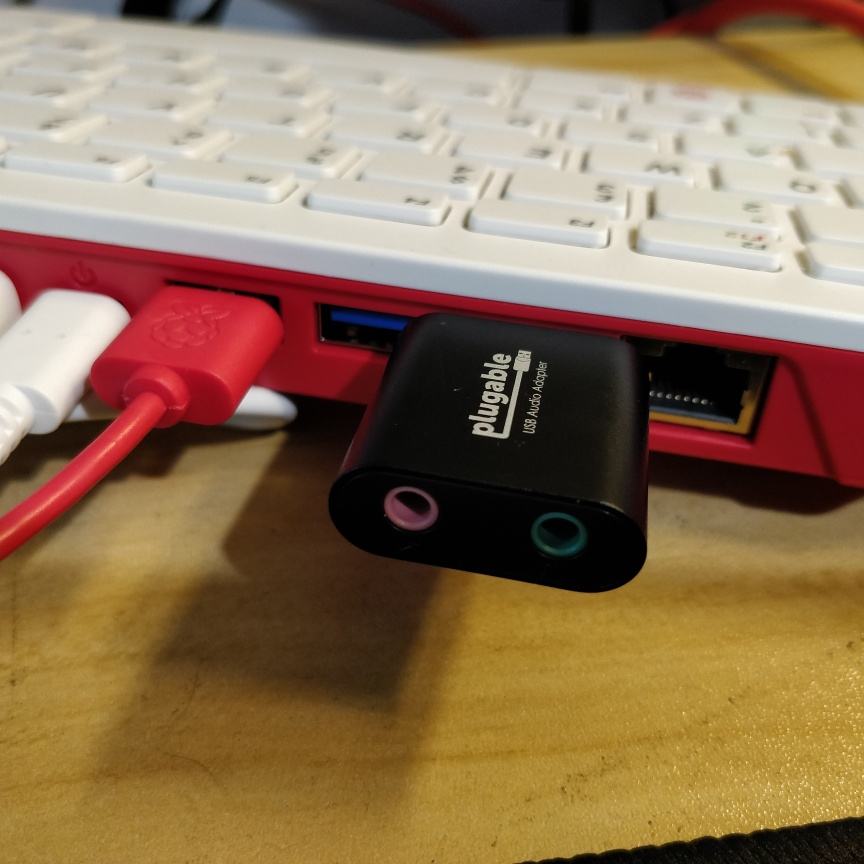

.. _pi_400_audio:

==================
树莓派400音频配置
==================

:ref:`pi_400` 是一个键盘一体化SBC系统，和 :ref:`pi_4` 几乎相同的硬件配置，如双HDMI视频输出。但是树莓派400没有提供音频3.5"插孔，也就是说无法直接连接耳机输出音乐。那么树莓派400如何实现桌面电脑多媒体功能呢？

.. figure:: ../../_static/raspberry_pi/hardware/pi_400_blueprint-labelled.png
   :scale: 70

可以看到， :ref:`pi_400` 具备2个mincro HDMI - HDMI即High-Definition Multimedia Interface。既然是Multimedia Interface(多媒体接口)，这也就说明HDMI接口是哦能够是可以输出视频和音频信号的。

配置HDMI音频输出
======================

树莓派原生的操作系统 Raspberry Pi OS提供了一个配置工具 ``raspi-config`` 可以调整启动参数，其中包括了调整音频通过HDMI输出。不过，我使用的 :ref:`kali_linux` for Raspberry Pi中提供的 ``raspi-config`` 没有这个功能。好在树莓派使用TF卡启动，可以很容易换成Raspberry Pi OS的TF卡，启动系统，执行官方原生 ``Raspberry Pi OS`` 的 ``raspi-config`` 工具，对比启动配置来获得所需修改的参数。

- 修订 ``/boot/config.txt`` ::

   hdmi_group=1
   hdmi_mode=16
   hdmi_drive=2

- 重启系统

- 重启系统后，执行 ``alsamixer`` 程序检查系统声卡设备，按下 ``F6`` 可以选择声卡设备，就能够看到系统识别出声卡: ``bcm2835 HDMI 1`` 

- 测试声音::

   sudo aplay /usr/share/sounds/alsa/Front_Center.wav

我使用HDMI链接的ACO显示器有音频输出3.5"插孔，可以通过耳机听到播放的声音，证明HDMI通道能够正确播放音频。

.. note::

   需要注意，很多音频类应用程序都是使用 :ref:`mpd` 后端来播放音乐，需要安装 ``mpd`` 软件包，并且配置 ``mpd.conf`` (或者由应用程序自动生成对应配置)。详细实践请参考 :ref:`mpd`

其他解决方法
==============

DACBerry 400 S (DBR400S)
-------------------------

`Add an audio jack to Raspberry Pi 400 with the DACBerry 400 <https://www.cnx-software.com/2021/10/05/add-an-audio-jack-to-raspberry-pi-400-with-the-dacberry-400/>`_ 介绍了 DACBerry 400 S (DBR400S)是GPIO接口声卡，而可以适配 :ref:`pi_400` 并且不会影响USB接口使用:

.. figure:: ../../_static/raspberry_pi/startup/pi_400_audio_jack.jpg
   :scale: 50

USB声卡
---------

`Spotify on the Raspberry Pi 400 <https://popey.com/blog/2020/12/spotify-on-the-raspberry-pi-400/>`_ 介绍了在 :ref:`pi_400` 上使用一个USB声卡(非常廉价只需要1美金)实现音频输出的解决方案，并且使用了 `ncspot <https://snapcraft.io/ncspot>`_ (Rust编写的字符终端Spotify客户端)可以完美播放音乐。

参考
======

- `No Audio on Raspberry Pi: A helpful, illustrated guide <https://funconsumertech.com/no-audio-on-raspberry-pi-a-helpful-illustrated-guide/>`_
- `Spotify on the Raspberry Pi 400 <https://popey.com/blog/2020/12/spotify-on-the-raspberry-pi-400/>`_
- `No audio from HDMI [solved] <https://forums.raspberrypi.com/viewtopic.php?t=305186>`_
