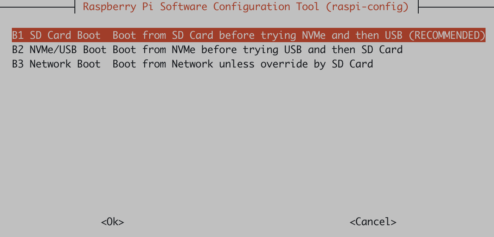

.. _pi_5_nvme_boot:

========================
树莓派5使用nvme存储启动
========================

在完成 :ref:`pi_5_pcie_m.2_ssd` 存储组装，并完成 :ref:`pi_5_pcie_3_m.2_ssd` 激活 ``PCIe gen3`` 支持之后，就可以配置 :ref:`pi_5` 从NVMe启动，这样所有数据存储在NVMe存储上，可以大大加速存储性能。

配置NVMe启动
==============

``raspi-config`` 提供了菜单方式配置存储启动顺序: ``Advanced Options > Boot Order > NVMe /USB Boot``

   默认启动顺序: ``SD => NVMe => USB`` ，该默认顺序基本满足要求

默认启动顺序其实也包含了NVMe启动，只不过NVMe启动顺序比SD卡低一级

.. _clone_pi_by_dd:

使用 ``dd`` clone树莓派
=========================

- 直接通过以下命令将树莓派SD卡内容完整复制到NVMe中，这样NVMe存储就完全替代了原先的SD卡:

.. literalinclude:: pi_5_nvme_boot/clone_pi
   :caption: 通过 ``dd`` 命令复制树莓派系统

复制前磁盘分区如下:

.. literalinclude:: pi_5_nvme_boot/clone_pi_before
   :caption: 通过 ``dd`` 命令复制树莓派系统前状态
   :emphasize-lines: 16,17

复制以后磁盘分区如下:

.. literalinclude:: pi_5_nvme_boot/clone_pi_before
   :caption: 复制系统前只有 ``mmcblk0`` 设备有2个分区
   :emphasize-lines: 16,17

复制以后通过 ``lsblk`` 可以看到:

.. literalinclude:: pi_5_nvme_boot/lsblk
   :caption: ``lsblk`` 可以看到NVMe存储现在和SD卡存储分区(内容)完全一致
   :emphasize-lines: 6,7

参考
========

- `How to boot Raspberry Pi 5 from NVMe M.2 SSD <https://notenoughtech.com/raspberry-pi/boot-raspberry-pi-5-from-nvme/>`_
- `NVMe SSD boot with the Raspberry Pi 5 <https://www.jeffgeerling.com/blog/2023/nvme-ssd-boot-raspberry-pi-5>`_
