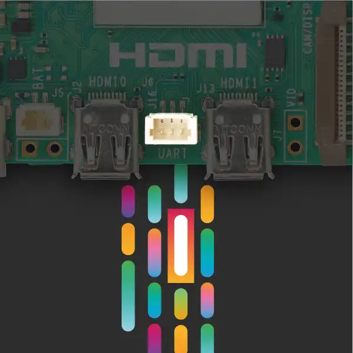

.. _pi_5_uart:

=========================
树莓派5 UART串口通讯
=========================

:ref:`pi_5` 提供了非常方便的UART串口通讯，也就是在的两个 ``HDMI`` 接口之间加了一个UART的连接插入接口:

   :ref:`pi_5` UART连接接口

参考
======

- `UART clock setting on RPi 5 <https://forums.raspberrypi.com/viewtopic.php?t=361321>`_
- `RPi5 UART connector type and voltage <https://forums.raspberrypi.com/viewtopic.php?t=358296>`_
