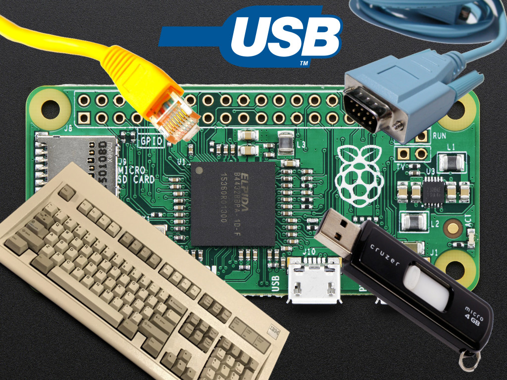

.. _usb_gadgets_on_pi_zero:

===========================
树莓派Zero构建USB gadgets
===========================

我在研究 :ref:`pikvm` 时了解到Linux的USB堆栈可以反转模拟很多USB设备(以下还混合了一些相关信息):

- 模拟USB键盘/鼠标

  - 结合 `Etherkey <https://github.com/Flowm/etherkey>`_ + `Teensy开发板 <https://www.pjrc.com/store/teensy41.html>`_ + `USB to UART serial bridges <https://www.sjoerdlangkemper.nl/2019/03/20/usb-to-serial-uart/>`_

- 模拟USB网络设备( :ref:`android_usb_tethering` )

  - `USB/IP Project <https://usbip.sourceforge.net/>`_ 在IP网络提供USB设备

- 模拟USB存储
- 模拟USB串口控制器

  - `USB to UART serial bridges <https://www.sjoerdlangkemper.nl/2019/03/20/usb-to-serial-uart/>`_

- 视频采集( 类似 ``EasyCAP USB video capture device`` 可以直接通过VLC采集 `EasyCap DC60 (STK1160) + VLC + Xubuntu 13.10 = OpenSource Video Capture!! <https://www.instructables.com/EasyCap-DC60-STK1160-VLC-Xubuntu-1310-OpenSource-V/>`_ / `Software for using EasyCAP USB video capture device <https://askubuntu.com/questions/614510/software-for-using-easycap-usb-video-capture-device>`_ )

  - `USB Audio/Video Capture on Linux <https://jahed.dev/2023/10/22/usb-audio-video-capture-on-linux/>`_ 提供了很好的经验

- `GitHub: linux-usb-gadgets/libusbgx <https://github.com/linux-usb-gadgets/libusbgx>`_ libusbgx is a C library encapsulating the kernel USB gadget-configfsuserspace API functionality.

总之，非常好玩，感觉也是一种有趣的生态，待实践...

参考
======

- `Composite USB Gadgets on the Raspberry Pi Zero <https://www.isticktoit.net/?p=1383>`_
- `GitHub: ckuethe/usbarmory <https://github.com/ckuethe/usbarmory/>`_ 一个使用i.MX535构建多功能USB设备的方案
- `Raspberry Pi Zero as Multiple USB Gadgets Dec22 <https://irq5.io/2016/12/22/raspberry-pi-zero-as-multiple-usb-gadgets/>`_
- `GitHub: Flowm/Etherkey <https://github.com/Flowm/etherkey>`_
- `How to simulate USB keyboard from machine? <https://superuser.com/questions/1128365/how-to-simulate-usb-keyboard-from-machine>`_

