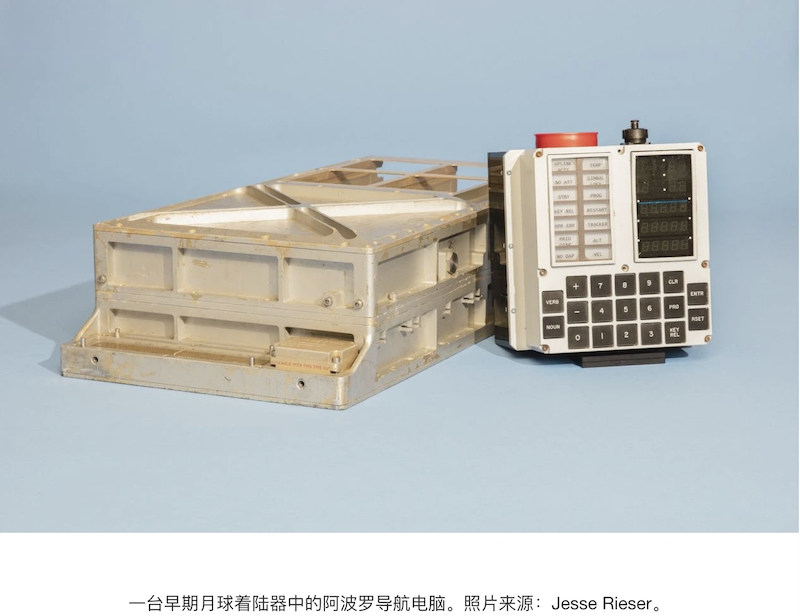

.. _mobile_work_think:

====================
移动工作思考
====================

1969年7月20日，阿波罗11号登月所使用的 `阿波罗制导计算机 <https://zh.wikipedia.org/wiki/%E9%98%BF%E6%B3%A2%E7%BD%97%E5%88%B6%E5%AF%BC%E8%AE%A1%E7%AE%97%E6%9C%BA>`_ (Apollo Guidance Computer，AGC): 第一台基于硅集成电路的计算机，性能仅相当于上世纪70年代末的第一代家用计算机，如Apple II。

然而这台简陋的计算机，却帮助人类踏上了月球:

.. figure:: ../../_static/real/mobile_work/aldrin_apollo_11.jpg
   :scale: 60

我们现在拥有的任何一部主流手机，其计算性能，已经远远超过当年的 ``阿波罗制导计算机`` ，然而，仅仅用来发送140个字符的twitter(现在是280字符)以及无法计数的垃圾短视频。拥有性能卓越的计算设备(Smart Phone)，实在是现代人的羞愧。

我个人觉得，功能强大的智能手机，应该能够做更多的事:

- 随时随地编写程序
- 随时随地撰写文章
- 做到接近个人电脑的生产力

实际上，由于个人原因，我需要在不同的地方工作(上网、开发、运维)。我当然可以背着一台笔记本到处跑，强大的MacBook Pro笔记本。然而，我觉得，如果能够充分利用好手上的智能手机，经过巧妙的开源软件拓展，能够实现个人在任何地点的移动工作:

- 大量的开发计算在精心部署的 :ref:`priv_cloud` 和 :ref:`edge_cloud` 上完成，移动设备仅仅是入口以及个人灵感的输入
- 通过外接显示器和蓝牙输入设备(键盘鼠标)，可以瞬间将智能手机转变成生产力工具

此外，长期的办公室工作，使得IT从业人员的肩背劳损，沉重的电脑包使得病痛加剧。倘若能够将智能手机的计算能力释放，对于个人而言也是极大的帮助。

计算机和智能手机厂商其实做过很多这方面的尝试，但是依然无法把这个市场做好:

- 现代化的影音娱乐，使得现代人已经难以摆脱智能手机的 ``奶头乐`` ，太容易沉迷于垂手可得的享受，再要将娱乐设备转成生产力设备，本能上是拒绝的
- 虽然AI已经能够帮助我们自动转换语音到文字输入，但是依然不如键盘鼠标交互方便。平板设备加上了键盘实际上就是笔记本电脑，但是融合两种设备的软件系统却迟迟无法达到预期

个人的选择
===========

像我这样的技术工作者，有比较特殊的需求:

- 主要的工作是远程服务器开发运维，所以对于客户端没有强需求，只需要 terminal 和 browser 就能完成 99.9% 的工作和生活
- 希望随时能够联网，开发程序，系统运维，智能手机已经具备这样的能力，只是需要一定的技术和技巧来实现:

  - 扩展屏幕(输出): 通过智能手机的有线视频输出( :ref:`android_displayport` ) 或者无线视频输出 ( ``chromecast`` 或 ``airplay`` )
  - 扩展输入: 蓝牙键盘鼠标
  - 软件组合:

    - 在Android系统中运行Linux
    - 使用Android原生的浏览器、IM软件等等，通过Andorid分屏功能实现切换帮助提高使用效率
    - 云计算服务器运行 :reff:`web_terminal` ，客户端可以使用手机浏览器实现移动办公

      - 本地使用手机浏览器连接云计算的(租用)虚拟机运行的 :ref:`guacamole` 来实现web登陆系统，获得完整的桌面和ssh环境

- 具备技术能力来整合各种开源软件实现自己的需求

总之，我构想的移动工作，通过智能手机(Android更具备开放性)，实现随时随地的联网开发运维工作。

iOS移动工作
============

iOS对屏幕外接输出支持较为完善，有两种方式:

- iOS系统原生支持通过 ``lightening`` 线缆输出屏幕，所以只要有一根合适线缆，就可以把手机/平板的屏幕输出到外接大显示器上 (待实践)
- :ref:`airplay` 可以通过网络实现iOS/macOS屏幕输出到其他iOS/macOS设备上，也提供兼容Apple TV输出

现有市场上，已经有第三方厂商提供了兼容 :ref:`airplay` 投屏设备，提供屏幕镜像输出，这样可以非常方便把手机/平板这样小屏幕输出到大屏幕上，方便文字类交互工作。

Android移动工作
=================

我使用 :ref:`pixel_4` (已替代 :ref:`pixel_3` )来实现移动办公，主要有两种模式:

- :ref:`termux` 实现在 :ref:`android` 系统内部运行一个微型Linux系统，实现完整的 :ref:`termux_dev` 以及 :ref:`termux_proxy` ，这样只需要一台简单的瘦客户机(有浏览器和termianl)，就可以实现访问办公网络以及无障碍访问互联网信息
- 对于没有完整瘦客户机的情况，如果有一个外接显示器和蓝牙键盘，那么采用 :ref:`android_mobile_work_solutions` 中 :ref:`termux` 结合外界显示器来实现

.. note::

   目前原生Android 13极以下系统都没有提供三星独有的 `Samsung DeX <https://www.samsung.com/us/apps/dex/>`_ ，而从Pixel 8开始，Google将为Android 14带来相似的原生功能，这将极大拓展Android 系统的灵活性，特别适合移动工作。

   阮一峰在 `科技爱好者周刊（第 277 期）：工作台副屏的最佳选择 <https://www.ruanyifeng.com/blog/2023/11/weekly-issue-277.html>`_ 也提出了采用 Samsung Dex 实现多窗口桌面工作的建议方案(他特意购买了二手的三星手机)。可见科技工作着都有着相似的需求和想法。

参考
======

- `阿波罗制导计算机 <https://zh.wikipedia.org/wiki/%E9%98%BF%E6%B3%A2%E7%BD%97%E5%88%B6%E5%AF%BC%E8%AE%A1%E7%AE%97%E6%9C%BA>`_
- `阿波罗计划 <https://zh.wikipedia.org/wiki/%E9%98%BF%E6%B3%A2%E7%BD%97%E8%AE%A1%E5%88%92>`_
- `程序员视角：50 年前的阿波罗登月是一场计算机的胜利 <https://www.infoq.cn/article/faocv1qqy-ujnjzabzwd>`_
