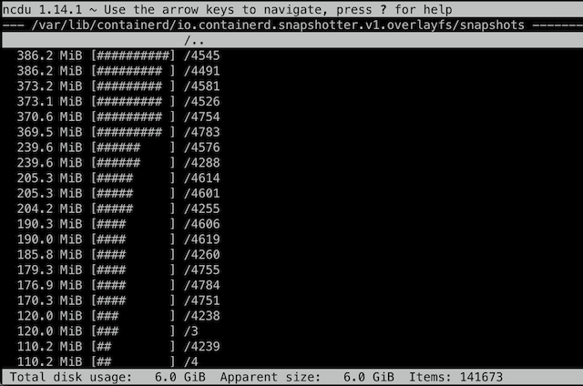

.. _trace_disk_space_usage:

======================
排查磁盘空间消耗
======================

在生产环境中，经常会遇到磁盘被耗尽的问题需要排查，通常我们会使用2个工具:

- ``df`` 检查文件系统总体使用情况

  - ``-i`` 参数查看 ``inode`` 占用情况，这个参数非常常用，因为很多时候会忽视掉 ``inode`` 被耗尽导致即使有空间内也无法存储数据问题

- ``du`` 检查目录占用磁盘情况

  - ``-sh *`` 可帮助我们检查当前目录下子目录占用空间

ncdu
=========

不过，我们经常会需要找出磁盘中占用最多的目录进行排查和清理，这时候，有一个基于 ``ncurse`` 终端交互命令 ``ncdu`` 非常有用，提供了默认从大到小排序功能，并且启动时完成扫描，然后就可以交互找到最占用磁盘空间的目录:

直接找出占用空间最大的目录(剔除子目录)
========================================

那么我们在脚本中该如何找到占用最大的目录呢？

虽然我们可以使用 ``du -sh *`` 一级级查找，但是在脚本中需要使用一条命令来找到最多消耗的目录::

   du -Sh | sort -rh | head -5

输出类似::

   1.2G ./var/lib/containerd/io.containerd.content.v1.content/blobs/sha256
   445M ./usr/bin
   332M ./run/containerd/io.containerd.runtime.v2.task/k8s.io/6bd8822f911f8cbbc51826a3c2d37c0016ec44a8138c9d835fb5dbae99db269f/rootfs/usr/bin
   328M ./home/huatai/z-k8s-dev
   318M .

为何要使用 ``-S`` 参数而不是常用的 ``-s`` (小写)参数呢？

::

   -S, --separate-dirs   for directories do not include size of subdirectories
   -s, --summarize       display only a total for each argument

这是因为我们希望能够直接找出是哪个目录包含了最多空间占用的文件，而不是一个目录包含了所有子目录的空间统计。这样会非常方便真正找到可以清理空间的最大占用目录。

删除文件不释放空间
===================

在线上环境，我们经常会发现有些(大)文件被删除后却没有释放空间: 这通产是因为运行的进程打开文件进行读写，但是文件被强行删除，此时文件句柄没有释放，则对操作系统来说删除的文件占用空间不会释放。

- 首先我们要找出这些被强行杀出但是没有释放空间的文件，以及对应的还没有释放句柄的进程::

   lsof | egrep "deleted|COMMAND"

例如输出::

   COMMAND      PID    TID TASKCMD              USER   FD      TYPE             DEVICE SIZE/OFF       NODE NAME
   networkd-   1645                             root  txt       REG                8,2  5490448    1835478 /usr/bin/python3.8 (deleted)
   unattende   1748                             root  txt       REG                8,2  5490448    1835478 /usr/bin/python3.8 (deleted)
   unattende   1748   1794 gmain                root  txt       REG                8,2  5490448    1835478 /usr/bin/python3.8 (deleted)
   none        2167                             root  txt       REG                0,1    17032      23779 / (deleted)
   squid     327045                             root    4u      REG                8,2    49320     527495 /var/log/squid/cache.log.1 (deleted)
   squid     357059                            proxy    4u      REG                8,2    49320     527495 /var/log/squid/cache.log.1 (deleted)

- 对于已经被强制删除的文件，空间不释放的解决方法通常是把依然打开文件句柄的进程重启掉，例如，上文中，我们可以通过重启 ``327045`` 和 ``357059`` (squid) 来真正释放空间

- 但是，有时候我们不能停止进程，又该如何释放之前被错误删除文件对应的空间呢？解决方法是从 ``/proc/<pid>/fd/<fd_number>`` 入手来 ``truncate`` 文件::

   echo > /proc/<pid>/fd/<fd_number>

举例上文 ``327045`` 和 ``357059`` (squid) 进程::

   file /proc/327045/fd/4

可以看到::

   /proc/327045/fd/4: symbolic link to /var/log/squid/cache.log.1 (deleted)

详细情况::

   ls -lh /proc/327045/fd/4

显示::

   lrwx------ 1 root proxy 64 Aug 26 15:44 /proc/327045/fd/4 -> '/var/log/squid/cache.log.1 (deleted)'

我们来清理掉这个占用空间::

   echo > /proc/327045/fd/4

此时，虽然文件句柄还不释放，但是已经把该文件句柄对应文件系统空间完全清零了，也就是释放出了空间

参考
======

- `Tracking down where disk space has gone on Linux? <https://unix.stackexchange.com/questions/125429/tracking-down-where-disk-space-has-gone-on-linux>`_
- `Why is space not being freed from disk after deleting a file in Red Hat Enterprise Linux? <https://access.redhat.com/solutions/2316>`_
