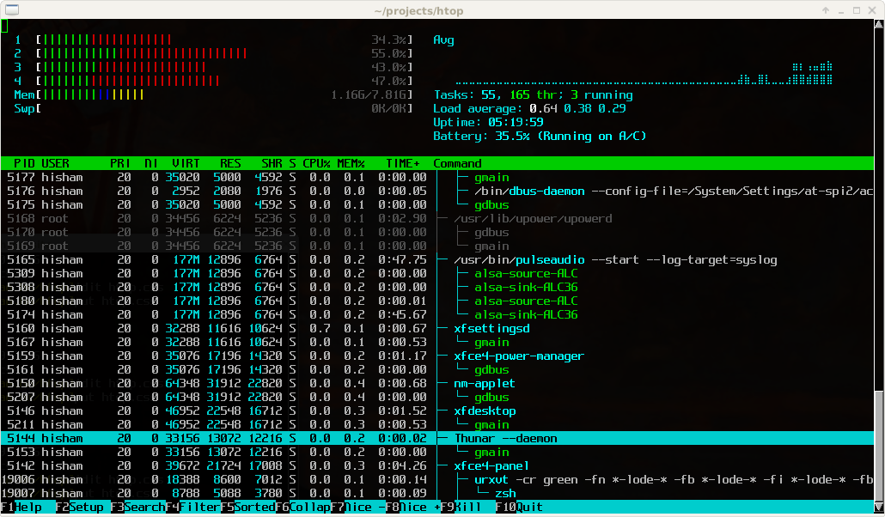

.. _htop:

===============
htop交互式top
===============

`htop - an interactive process viewer <https://htop.dev/>`_ 是一个交互方式的top工具，提供饿了非常直观观察系统的方式:

``htop`` 使用c语言编写，非常快速和轻量级，并且提供了非常丰富等监控功能，不经能够监控cpu等常规目标，而且可以监控磁盘、网络，并且细分了不同进程的检查角度。

功能
======

- 监控进程磁盘读写: 这个功能在排查服务器 ``iowait`` 高的异常时非常有用，不需要安装 ``iotop`` 这样的功能单一工具，就可以实现全功能的磁盘、网络等监控

  - ``F2 -> Columns -> Set IO_RATE (or IO_RATE_READ/IO_RATE_WRITE) -> F10``

参考
========

- `htop - an interactive process viewer <https://htop.dev/>`_ htop官方网站
- `How to monitor disk activity? <https://askubuntu.com/questions/276669/how-to-monitor-disk-activity>`_
