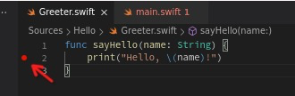

.. _swift_on_linux_archive:

=============================
在Linux环境开发Swift(归档)
=============================

.. warning::

   本文是很久以前的实践，现在(2025年)实践见 :ref:`swift_on_linux`

2018年10月， `苹果宣布Swift将通过LSP支持非Apple平台 <https://forums.swift.org/t/new-lsp-language-service-supporting-swift-and-c-family-languages-for-any-editor-and-platform/17024>`_ ，通过开源 `SourceKit-LSP <https://github.com/apple/sourcekit-lsp>`_ 可以在Linux平台使用Swift语言进行开发。你可以通过Language Server Protocol (LSP) 来结合 :ref:`vscode`
在Linux平台开发Swift语言的服务器软件。这种以Swift语言为基础的全栈技术，可以帮助我们锻炼Swift开发能力，更好辅助iOS/macOS等移动设备软件开发。

安装Swift
==========

在 `Swift website Download <https://swift.org/download#snapshots>`_ 提供了软件包以及针对不同Linux版本 `swift recommended toolchain <https://github.com/apple/sourcekit-lsp/blob/master/Documentation/Development.md#recommended-toolchain>`_ 。虽然官方网站只提供了Ubuntu和CentOS以及Amazon Linux2 和Windows 10版本，但是实际Fedora的软件仓库也直接提供了Swift::

   sudo dnf -y install swift-lang

.. note::

   2021年底，我在 :ref:`priv_cloud_infra` 重新实现了开发环境 ``z-dev`` ，采用 :ref:`fedora` 环境，所以我的Swift for Linux也是在Fedora 35上实践的。

如果你在Ubuntu环境下安装，则下载对应的toolchain，然后使用以下命令安装(注意 ``FILE`` 替换成下载的文件名) ::

   sudo apt-get install curl clang libicu-dev git libatomic1 libicu60 libxml2 libcurl4 zlib1g-dev libbsd0 tzdata libssl-dev libsqlite3-dev libblocksruntime-dev libncurses5-dev libdispatch-dev -y
   mkdir ~/swift
   tar -xvzf FILE -C ~/swift

然后创建环境 ``~/.bashrc`` 配置如下::

   export PATH="~/swift/FILE/usr/bin:$PATH"

一旦安装完成，使用以下命令验证::

   swift --version

输出类似( :ref:`fedora` )::

   Swift version 5.5.2 (swift-5.5.2-RELEASE)
   Target: x86_64-unknown-linux-gnu

运行问题排查
==============

- 尝试执行  `A Complete Guide to Swift Development on Linux <https://www.raywenderlich.com/8325890-a-complete-guide-to-swift-development-on-linux>`_ 提供的demo，发现有如下报错::

   ...
   /home/huatai/Todos/Starter/.build/checkouts/swift-nio/Sources/NIO/ContiguousCollection.swift:21:1: error: type 'StaticString' does not conform to protocol 'Collection'
   extension StaticString: Collection {
   ^
   /home/huatai/Todos/Starter/.build/checkouts/swift-nio/Sources/NIO/ContiguousCollection.swift:21:1: error: unavailable subscript 'subscript(_:)' was used to satisfy a requirement of protocol 'Collection'
   extension StaticString: Collection {
   ^
   Swift.Collection:3:12: note: 'subscript(_:)' declared here
       public subscript(bounds: Range<Self.Index>) -> Self.SubSequence { get }
              ^
   Swift.Collection:12:5: note: requirement 'subscript(_:)' declared here
       subscript(bounds: Range<Self.Index>) -> Self.SubSequence { get }
       ^

这个问题在 `This repo no longer builds with the latest official trunk snapshots for linux: an upstream stdlib change probably broke building NIO #1892 <https://github.com/apple/swift-nio/issues/1892>`_ 有解释说明
   
Language Server Protocol
==========================

安装
---------

:ref:`vscode_lsp` 可以实现不同语言的智能开发，包括Swift语言，苹果公司提供了 `SourceKit-LSP <https://github.com/apple/sourcekit-lsp>`_ 来实现

- 在 :ref:`ubuntu_linux` 上可以通过以下命令安装 `SourceKit-LSP <https://github.com/apple/sourcekit-lsp>`_ ::

   curl -sL https://deb.nodesource.com/setup_12.x | sudo -E bash - # You can skip this command if you already have node installed.
   sudo apt-get install -y nodejs # Same goes for this command.
   git clone https://github.com/apple/sourcekit-lsp.git
   cd sourcekit-lsp/

   swift package update  #1
   swift build -Xcxx -I/home/YOURUSER/swift/FILE/usr/lib/swift #2 
   sudo mv .build/x86_64-unknown-linux-gnu/debug/sourcekit-lsp /usr/local/bin #3

1. 更新 Swift 最新版本
2. 源代码编译SourceKit-LSP，这里的 ``-I`` 参数添加了C++编译器将要查看 ``.h`` 文件的扩展目录
3. 将编译后的二进制执行程序移动到 ``/usr/local/bin`` 目录，这样 VSCode 就能使用它

- Apple的 `Swift官方提供下载Toolchain <https://www.swift.org/download/>`_ 包含了支持CentOS 7和CentOS 8，所以只要安装了官方的ToolChain之后就自动在 ``bin`` 目录下有 ``sourcekit-lsp``

- Fedora 35 虽然软件仓库提供了 ``swift-lang`` ，但是没有提供 ``SourceKit-LSP`` ，所以也需要从源代码编译::

   # 需要安装nodejs
   sudo dnf install nodejs -y
   # 下载SourceKit-LSP
   git clone https://github.com/apple/sourcekit-lsp.git
   cd sourcekit-lsp/Editors/vscode
   # 编译扩展，在out目录下创建 .vsix 包
   npm install
   npm run dev-package
   # 安装扩展
   code --install-extension sourcekit-lsp-development.vsix

配置
---------

- 在 VSCode 的 ``Preferences > Extensions > SourceKit-LSP`` 可以找到已经安装好的 ``sourcekit-ls``

Hello World
==============

使用包管理器
-------------

- 创建包::

   mkdir Hello
   cd Hello

   swift package init

- ``init`` 会创建以下目录结构::

   .
   ├── Package.swift
   ├── README.md
   ├── Sources
   │   └── Hello
   │       └── Hello.swift
   └── Tests
       └── HelloTests
           └── HelloTests.swift

- 可以编译包::

   swift build

提示::

   [4/4] Build complete!

- 测试包::

   swift test

注意， ``swift package init`` 没有参数不创建 ``main.swift`` ，则编译后不是可执行代码

编译可执行程序
------------------

- 重新创建一个空目录::

   mkdir Hello
   cd Hello

- 初始化，这次使用可执行类型::

   swift package init --type executable

- 编译并运行::

   swift run Hello

此时可以看到::

   [6/6] Build complete!
   Hello, world!

- 也可以分开步骤::

   swift build

编译输出的目录在隐含目录 ``.build`` 目录下，所以执行方法::

   .build/x86_64-unknown-linux-gnu/debug/Hello

输出也可以看到::

   Hello, world!

使用VSCode开发验证LSP
========================

- 在 ``Sources/Hello`` 目录下添加一个 ``Greeter.swift`` 文件，并在 ``VSCode`` 中进行代码输入::

   func sayHello(name: String) {
       print("Hello, \(name)!")
       
   }

此时使用VSCode，可以看到IDE自动提示代码，表明安装的 ``SourceKit-LSP`` 能够正常工作

- 修改 ``main.swift`` ::

   if CommandLine.arguments.count != 2 {
       print("Usage: hello NAME")
   } else {
       let name = CommandLine.arguments[1]
       sayHello(name: name)
   }

- 然后运行::

   swift run Hello `whoami`

就会看到输出类似::

   Hello, huatai!

Debug Swift
==============

lldb debugging
-----------------

Swift使用 ``lldb`` 来debug程序，这也是Xcode使用的默认debugger。 ``lldb`` 可以用于debug C, Objective-C, C++ 和 Swift。

- 安装::

   sudo dnf install lldb

- 重新进行编译::

   lldb .build/debug/Hello `whoami`

此时进入 LLDB 会话，注意程序尚未启动，需要设置一个断点::

   (lldb) target create ".build/debug/Hello"
   Current executable set to '/home/huatai/github.com/etudes/swift/Hello/.build/debug/Hello' (x86_64).
   (lldb) settings set -- target.run-args  "huatai"
   (lldb)

- 假设在 ``Greeter.swift`` 中设置断点，则在 ``LLDB`` 会话中执行::

   breakpoint set -f Greeter.swift -l 2

提示信息::

   Breakpoint 1: where = Hello`$s5Hello03sayA04nameySS_tF + 58, address = 0x000000000000111a

- 然后按下 ``r`` 运行程序，立即执行到 ``Greeter.swift`` 的第2行并暂停::

   Process 61489 launched: '/home/huatai/github.com/etudes/swift/Hello/.build/debug/Hello' (x86_64)
   This version of LLDB has no plugin for the language "swift". Inspection of frame variables will be limited.
   Process 61489 stopped
   * thread #1, name = 'Hello', stop reason = breakpoint 1.1
       frame #0: 0x000055555555511a Hello`$s5Hello03sayA04nameySS_tF at Greeter.swift:2:11
      1   	func sayHello(name: String) {
   -> 2   	    print("Hello, \(name)!")
      3   	}
   (lldb)

- 按下 ``c`` 完成程序执行

使用VSCode进行debugging
-------------------------

- 在 VSCode 中安装 ``CodeLLDB`` 就能够在VSCode中使用 ``lldb`` 进行调试

  - 在VSCode中按下 ``Control+Shift+X`` 搜索 ``CodeLLDB`` 并安装

- 要配置VSCode使用LLDB进行Swift debug，需要在项目中创建一个 ``.vscode`` 目录，并在这个目录下创建2个文件

.. literalinclude:: swift_on_linux_archive/launch.json
   :language: bash
   :linenos:
   :caption: .vscode/launch.json

1. ``lldb`` 表示VSCode将使用 CodeLLDB
2. 使用的程序，这里是 ``Hello`` 执行程序
3. 这里需要传递一个参数，对于命令行参数，传递 ``"${cwd}"`` ，也就是 ``"${whoami}"``
4. 在运行程序前加载的任务，也就是build程序

.. literalinclude:: swift_on_linux_archive/tasks.json
   :language: bash
   :linenos:
   :caption: .vscode/tasks.json

1. ``label`` 是 ``launch.json`` 标记
2. ``type``  是 shell，表明运行的plain shell命令
3. ``command`` 是确保不会错失修改

在 ``Greter.swift`` 文件中，鼠标移动到第2行边上，当浮现出暗红色圆点时候点击一下这个圆点，则圆点转为鲜红色并固定，这就表示断点 ``breakpoint`` :

使用 :ref:`vscode_debugging` ，按下 ``F5`` 启动debuging运行，此时可以和之前使用 ``lldb`` 命令行相同效果，停留在 ``Greeter.swift`` 的第2行

.. figure:: ../_static/swift/vscode_debugging_breakpoint.png

详细 debuging 方法参考 :ref:`vscode_debugging`

参考
======

- `A Complete Guide to Swift Development on Linux <https://www.raywenderlich.com/8325890-a-complete-guide-to-swift-development-on-linux>`_
- `SourceKit-LSP Editors README <https://github.com/apple/sourcekit-lsp/blob/main/Editors/README.md>`_
- `Building and Installing the Extension <https://github.com/apple/sourcekit-lsp/blob/main/Editors/vscode/README.md#building-and-installing-the-extension>`_
- `Swift官网 Getting Started <https://www.swift.org/getting-started/>`_
