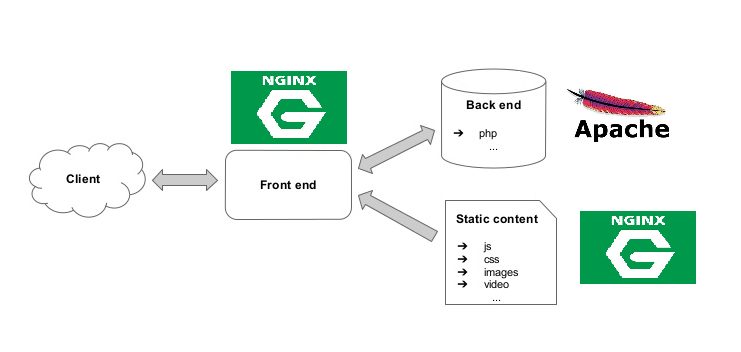

.. _apache_vs_nginx:

====================
Apache Vs NGINX
====================

Apache HTTP Server
=====================

`Apache HTTP Server <https://httpd.apache.org/>`_ 是非常稳定发展的HTTP WEB服务器。从1995年作为 ``httpd`` 发布依赖，已经成为最成功的开源项目(Apache软件基金会成为众多重量级开源项目的支持者)。

和 :ref:`nginx` (WEB服务器+反向代理)不同，Apache httpd是纯粹的WEB服务器，在长期的开发过程中，积累了大量的核心模块功能，可以说是功能最全面的WEB服务器

NGINX
=======

NGINX是2004年由Igor Sysoev开发的WEB服务器，并且提供了反向代理功能。由于NGINX采用了Event-Driven处理(无阻塞事件驱动连接处理算法, non-blocking event-driven connection handling algorithm)，同样的硬件条件比Apache能够处理更多连接请求(在单个处理线程可以处理数千连接请求)，所以常常用于静态内容分发；此外，NGINX的反向代理功能(应用层负载均衡)非常适合对不同的WEB访问进行分流，所以也是常用的反向代理，负载均衡，邮件代理以及HTTP缓存。

.. note::

   NGINX可能比较适合不需要强审计和控制的代理环境，对于企业级的监控类代理， :ref:`squid` 可能是更为常用的解决方案。而对于高并发重负载以及海量缓存的CDN缓存环境， :ref:`trafficserver` 可能是更为合适的解决方案。

取长补短
=========

虽然NGINX在静态内容服务上性能卓越(比Apache快)，但是核心模块功能不及Apache，对于特定的服务需求(例如 :ref:`webdav` )需要使用第三方模块，部署配置复杂且可能无法达到一致的软件质量(第三方模块停止发展)。所以，在动态内容服务上，可以采用Apache来弥补NGINX的不足(Apache可以在web服务器内部处理动态内容无需依赖扩展组件)。

   
   NGINX结合Apache: Apache负责动态内容，NGINX负责静态内容

.. note::

   对于动态内容请求，实际上Apache和NGINX没有本质的性能区别，而Apache丰富的核心模块可以在动态内容展示上提供更多的完善支持。

参考
======

- `Apache Vs NGINX – Which Is The Best Web Server for You? <https://serverguy.com/comparison/apache-vs-nginx/>`_ 
