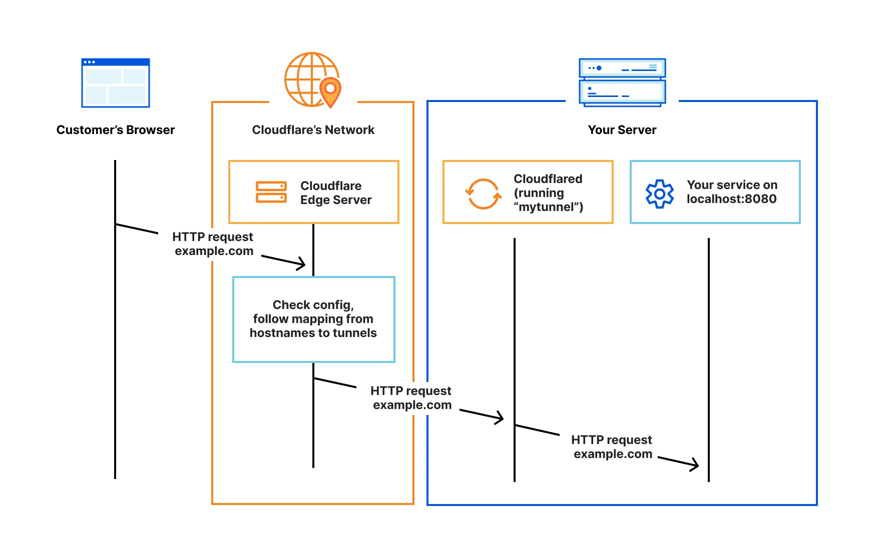
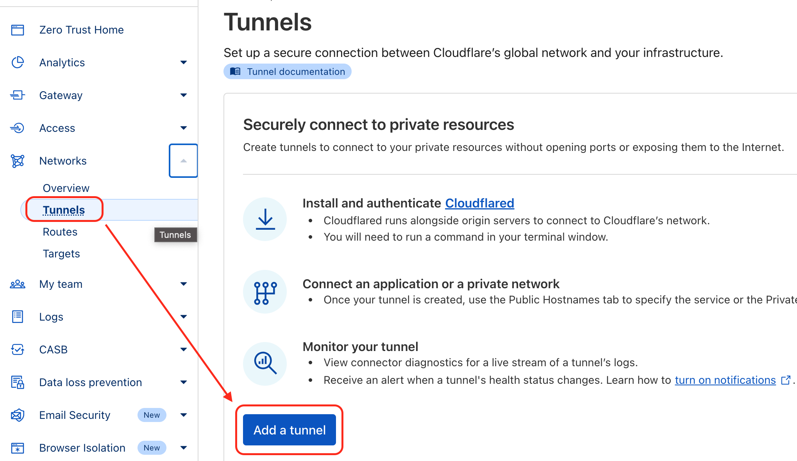
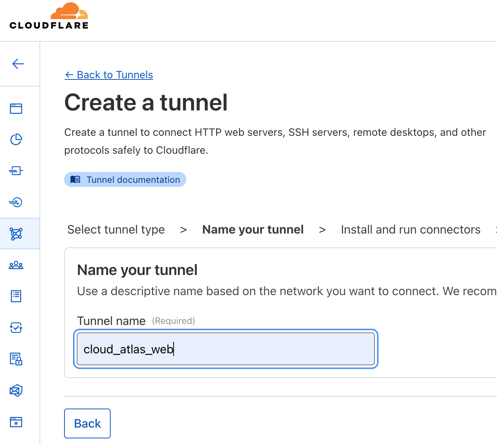
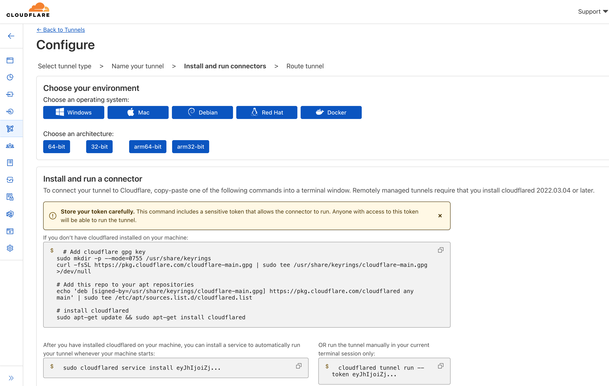
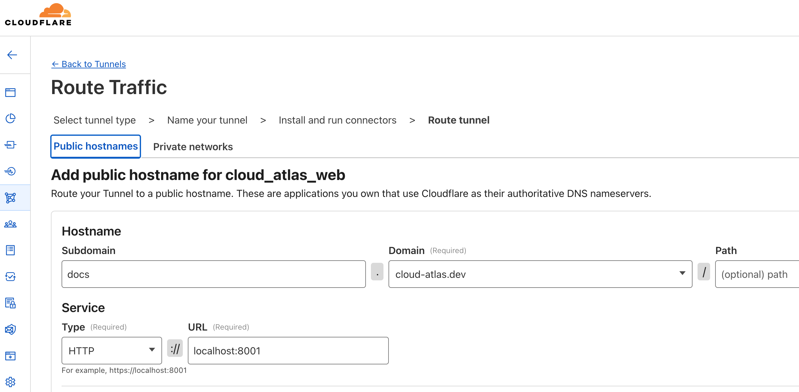

.. _cloudflare_tunnel:

=====================
Cloudflare Tunnel
=====================

我在部署自己的 「云图 -- 云计算图志」 `docs.cloud-atlas.dev <https://docs.cloud-atlas.dev>`_ 最初采用了 :ref:`nginx_reverse_proxy_https` (部署在阿里云) 结合 :ref:`ctunnel` 穿透连接家里的树莓派集群来构建。方案初步验证是可行的，但是发现如果不进行网站备案，阿里云会在检测到 :ref:`sni` 包含未备案域名后RESET连接。很不幸， ``.dev`` 域名是无法在大陆云计算平台备案的，这迫使我寻求其他解决方案。

虽然我也租用了海外的VM，但是由于GFW的干扰，实际 :ref:`ssh_tunneling_remote_port_forwarding` 数据传输稳定性不佳，难以满足个人网站的访问。)，所以考虑采用更为稳定的Cloudflare服务:

- 由Cloudflare Tunnel来承担 :ref:`nginx_reverse_proxy_https` + :ref:`ctunnel` 工作，自带SSL认证
- 后续再将DNS迁移到Cloudfare DNS来使用 :ref:`cloudflare_cdn`

Cloudflare Zero Trust
=========================

Cloudflare Tunnel 属于 Cloudflare Zero Trust 产品系列，提供了无需公共可陆游IP地址就能将自己的服务器资源和Cloudflare连接起来的安全方式。原理可以参考 :ref:`ssh_tunneling_remote_port_forwarding` 。

通过使用Cloudflare Tunnel，只需要一个轻量级的 ``cloudflared`` 创建 ``outbound-only-connections`` 连接Cloudflare的全球网络，就可以穿透允许外出方向流量的防火墙，将内部服务器资源对公网服务。这种方式能够对外提供 :ref:`web` 服务、 :ref:`ssh` 服务、remote desktop或其他Cloudflare允许的服务。这种依托Cloudflare的对外服务，也避免了外部攻击绕过Cloudflare。

创建tunnel
=============

首先需要在 `Cloudflare Dashboard > Zero Trust <https://one.dash.cloudflare.com/>`_ 创建Tunnel

- 使用左方的导航栏 ``Network >> Tunnels`` ，然后点击 ``Add a tunnel``

- 有两种tunnel类型，选择 ``Cloudflared`` 类型(另一种 WARP Connector 主要用于较为复杂的组网)

这里需要为自己的tunnel命名，我设置为 ``cloud_atlas_web`` 表示为自己的 ``cloud-atlas.dev`` 构建WEB

- 在 ``Install and run connectors`` 页面，按照自己的环境选择，此时页面会给出不同环境的安装方法指引: 我这里的实践是在 :ref:`raspberry_pi` 环境，所以我选择了 :ref:`debian` 和 ``arm64-bit`` :

- 在 :ref:`raspberry_pi` ( :ref:`debian` ) 系统中执行以下安装命令:

.. literalinclude:: cloudflare_tunnel/debian_install_cloudflared
   :caption: debian系列安装cloudflared

在这个配置页面中，复制页面指引的安装命令(直接点以下复制按钮完整复制安装命令，因为 ``install eyJhIjoiZj...`` 实际上是一长串代表前面创建服务的token)

.. literalinclude:: cloudflare_tunnel/cloudflared_service_install
   :caption: 复制并执行安装命令

如果没有异常，则会提示 :ref:`systemd` 服务安装成功

.. literalinclude:: cloudflare_tunnel/cloudflared_service_install_output
   :caption: 复制并执行安装服务成功

- 点击config页面的 ``Next`` 按钮，进入最后一步 ``Route Traffic`` 配置:

我配置了一个 `docs.cloud-atlas.dev <https://docs.cloud-atlas.dev>`_ 域名对外提供服务

对应了内部网络本地一个web服务 http://localhost:8001

可以看出 ``cloudflared`` 在局域网内部可以负责转发到内部任意一个主机的端口，也就是说后续我可以部署一个 :ref:`kubernetes` 集群，并将 :ref:`metallb` 上的负载均衡服务端口输出出去(待实践)

.. note::

   ``Route Traffic`` 配置步骤会在托管在Cloudflare的域名管理中(例如我的 ``cloud-atlas.dev`` )添加一条 ``docs.cloud-atlas.dev`` 的 ``CNAME`` 记录，指向Cloudflare提供的Tunnel Proxy。所以一定要确保当前DNS记录中没有 ``docs.cloud-atlas.dev`` ，这条记录需要让cloudflare的tunnel管理面板自动添加。

后端WEB服务器配置
====================

在上述配置了Cloudflare Tunnel的工作完成后(案例中tunnel对应的是本地的8001端口的WEB服务器)，需要在本地部署一个8001端口的 :ref:`nginx` 服务来提供 ``docs.cloud-atlas.dev`` 内容。也就是我使用 :ref:`docusaurus` 构建的文档网站

既然通过端口来区分后端服务，那么我在 ``/etc/nginx/sites-available/`` 中添加配置 ``docs.cloud-atlas.dev`` :

.. literalinclude:: cloudflare_tunnel/docs.cloud-atlas.dev
   :caption: ``/etc/nginx/sites-available/docs.cloud-atlas.dev`` 配置NGINX
   :emphasize-lines: 7

.. note::

   这里我在配置中添加了一行 ``port_in_redirect off;`` 以解决 :ref:`nginx_port_in_redirect` 问题

参考
======

- `Cloudflare Zero > Trust Connections > Cloudflare Tunnel <https://developers.cloudflare.com/cloudflare-one/connections/connect-networks/>`_
- `无需公网IP！CloudFlare Tunnel内网穿透实现内网访问 <https://post.smzdm.com/p/admp85dn/>`_
- `基于 Cloudflare Tunnel 进行内网穿透 <https://gythialy.github.io/expose-homelab-service-via-cloudflare-tunnel/>`_
- `使用Cloudflare Tunnel实现内网穿透，把服务器架在家里 <https://bra.live/setup-home-server-with-cloudflare-tunnel/>`_
- `CloudFlare Tunnel 免费内网穿透的简明教程 <https://sspai.com/post/79278>`_

