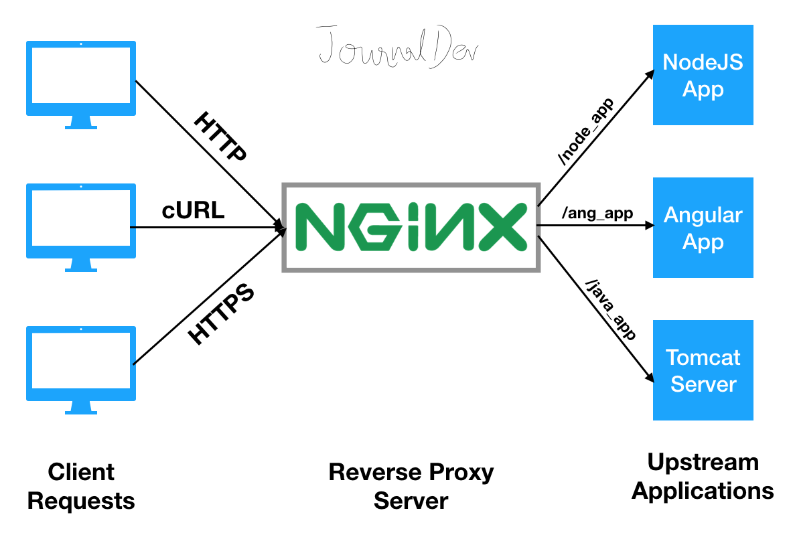

.. _nginx_reverse_proxy_nodejs:

=================================
NGINX反向代理Node.js应用
=================================

   NGINX反向代理服务器提供Node.js应用的访问

部署 :ref:`nodejs_dev_env` 完成 :ref:`patternfly` 开发，应用部署到线上，则需要结合nginx部署。原理就是采用NGINX反向代理，将Nodejs服务输出。

配置反向代理
===================

- 关键配置(2行):

.. literalinclude:: nginx_reverse_proxy_nodejs/nginx_reverse_proxy_nodejs.conf
   :language: bash
   :caption: 配置反向代理
   :emphasize-lines: 16,17

其中配置行::

   include proxy_params;

也可以替换为::

   proxy_http_version 1.1;  
   proxy_set_header Upgrade $http_upgrade;  
   proxy_set_header Connection 'upgrade';  
   proxy_set_header Host $host;  
   proxy_cache_bypass $http_upgrade;

错误排查
============

没有传递 ``proxy_params``
---------------------------

- 只配置:

.. literalinclude:: nginx_reverse_proxy_nodejs/simple_proxy_pass
   :language: bash
   :caption: 只配置一行 proxy_pass
   :emphasize-lines: 9

访问 :ref:`patternfly` 页面完全空白，检查 NGINX 日志 ``error.log`` 显示::

   2022/12/15 20:01:23 [error] 92437#92437: *34 open() "/usr/share/nginx/html/main.bundle.js" failed (2: No such file or directory), client: 11.33.57.34, server: onesre.cloud-atlas.io, request: "GET /main.bundle.js HTTP/1.1", host: "onesre.cloud-atlas.io", referrer: "https://onesre.cloud-atlas.io/dashboard/"

- 改为添加 ``proxy_params`` :

.. literalinclude:: nginx_reverse_proxy_nodejs/proxy_pass_proxy_params
   :language: bash
   :caption: 配置 proxy_pass 和 proxy_params
   :emphasize-lines: 9,10

则 ``error.log`` 日志不再报错

WEB显示 ``Invalid Host header``
------------------------------------

但是WEB浏览器访问发现页面显示::

   Invalid Host header

参考 `I am getting an "Invalid Host header" message when connecting to webpack-dev-server remotely <https://stackoverflow.com/questions/43619644/i-am-getting-an-invalid-host-header-message-when-connecting-to-webpack-dev-ser/51463168#51463168>`_ 原因应该是 ``webpack-dev-server`` 会检查客户端主机，由于开启了NGINX反向代理，对于 ``webpack-dev-server`` 访问是来自回环地址，可能检测不通过。

早期 ``webpack-dev-server`` 可以添加一个 ``disableHostsCheck`` 参数，例如::

   devServer: {
      disableHostCheck: true,
      ...
   }

但是现在这个参数会报错

所以改为::

   devServer: {
      allowedHosts: 'all',
      ...
   }

果然，WEB页面不再报错 ``Invalid Host header``

然而，又回到开头了，再次在 NGIX ``error.log`` 日志中看到::

   2022/12/15 20:56:40 [error] 84893#84893: *19 open() "/usr/share/nginx/html/main.bundle.js" failed (2: No such file or directory), client: 11.188.151.43, server: onesre.cloud-atlas.io, request: "GET /main.bundle.js HTTP/1.1", host: "onesre.cloud-atlas.io", referrer: "https://onesre.cloud-atlas.io/dashboard/"

我仔细看了一下 ``access.log`` 日志，发现原来确实有访问 ``/main.bundle.js`` ，日志如下::

   ==> access.log <==
   11.34.18.55 - - [15/Dec/2022:21:04:17 +0800] "GET /dashboard/ HTTP/1.1" 304 0 "-" "Mozilla/5.0 (X11; Linux aarch64) AppleWebKit/537.36 (KHTML, like Gecko) Chrome/108.0.0.0 Safari/537.36" "42.120.74.204"
   11.34.18.55 - - [15/Dec/2022:21:04:17 +0800] "GET /main.bundle.js HTTP/1.1" 404 555 "https://onesre.cloud-atlas.io/dashboard/" "Mozilla/5.0 (X11; Linux aarch64) AppleWebKit/537.36 (KHTML, like Gecko) Chrome/108.0.0.0 Safari/537.36" "42.120.74.204"

看来因为 webpack 将路径设为 ``/`` ，而不是子目录，所以修订 NGINX 配置改为::

   ...
      location / {
          include proxy_params;
          proxy_pass http://127.0.0.1:9000;  
      } 

参考
=======

- `NGINX as Reverse Proxy for Node or Angular application <https://www.digitalocean.com/community/tutorials/nginx-reverse-proxy-node-angular>`_
