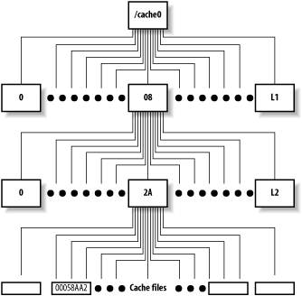

.. _squid_cache_dir:

==========================
Squid ``cache_dir`` 指令
==========================

``cache_dir``
===============

在 ``/etc/squid.conf`` 中，你可能会看到以下配置:

.. literalinclude:: squid_cache_dir/squid_cache_dir_default.conf
   :language: bash
   :caption: /etc/squid.conf 默认的 ``cache_dir`` 配置

配置语法:

.. literalinclude:: squid_cache_dir/squid_cache_dir_format
   :language: bash
   :caption: ``cache_dir`` 配置格式

上述简单配置中 ``100 16 256`` 分别代表:

  - 100MB 缓存空间，也就是 ``/var/cache/squid`` 目录下的磁盘空间限制。注意，不要将整个磁盘空间都分配给squid缓存目录，通常只使用磁盘空间80%(也即是减去20%)
  - ``16`` 表示一级缓存子目录数量，默认是 16 ，此时你会看到在 ``/var/cache/squid`` 目录下有16个子目录，分别是 ``00 到 0F``
  - ``256`` 表示二级缓存子目录数量，默认是 256，此时会看到每个一级缓存目录下有256个子目录用来真正存储缓存数据

上述配置表明设置了一个 ``/var/cache/squid`` 磁盘缓存目录。实际上，Squid支持更多的缓存目录，例如，存储服务器通常会有多块本地磁盘，可以充分发挥本地磁盘作为缓存目录:

.. literalinclude:: squid_cache_dir/squid_cache_dir_multi.conf
   :language: bash
   :caption: /etc/squid.conf 多个(案例为5个) ``cache_dir`` 缓存目录配置

.. note::

   对于文件系统，不仅要考虑容量(capacity)还需要考虑inode。

磁盘缓存大小和进程大小关系
=============================

Squid磁盘空间使用直接和内存使用量相关: 每个磁盘缓存对象都会需要一小块内存。Squid使用内存来索引磁盘上的数据。当添加新的缓存目录或者增加磁盘缓存大小，都需要确保系统有足够的内存，否则会导致Squid性能急剧下降(当超出物理内存)。

根据所用系统不同，每个在Squid缓存目录中的对象消耗76或112字节内存。内存分配举例: StoreEntry, MD5摘要, LRU策略节点结构。对于小指针(如32位)系统，消耗76字节；对于64位指针的CPU，则消耗112字节。

L1和L2缓存
============

对于ufs, aufs 和 diskd schemes，Squid创建两层目录结构来构建缓存目录。配置中L1和L2参数指定了第一层和第二层目录的数量，默认是 ``16`` 和 ``256`` :

   ufd-based存储schemes的缓存目录结构

对于L1和L2的目录参数配置主要考虑缓存目录总大小和主要缓存文件大小:

- Linux文件系统单个目录下存储文件数量有上限限制，特别是单个目录下文件达到极大数量会影响性能
- 通常我们会确保L2单个目录下文件不至于过多

可选参数
==========

Squid的 ``ufs`` 存储scheme 可选 ``cache_dir`` 参数有2个:

- ``read-only`` : 配置 ``cache_dir`` 是否停止存储新对象(例如存储空间过满)
- ``mac-size`` : 指定缓存目录中存储对象的最大大小(字节)

.. note::

   其他存储类型可选参数还有其他选项，具体参考 `Squid configuration directive cache_dir <http://www.squid-cache.org/Doc/config/cache_dir/>`_

参考
======

- `Squid The definitive guide: The cache_dir Directive <http://etutorials.org/Server+Administration/Squid.+The+definitive+guide/Chapter+7.+Disk+Cache+Basics/7.1+The+cache_dir+Directive/>`_
