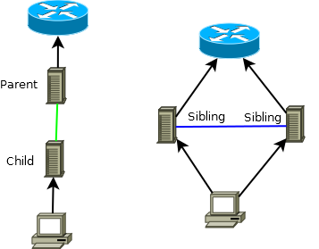
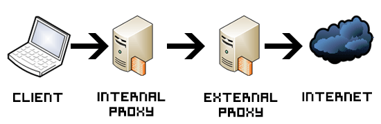

.. _squid_socks_peer:

===================
Squid父级socks代理
===================

在局域网部署的Squid代理服务器，在没有配置上一级转发代理之前，其实和局域网中其他电脑能够访问的网站是完全一样的。需要给Squid服务器配置一个父级代理，父级代理是能够翻墙的代理服务器，这样局域网部署的Squid就具备了翻墙的功能。

.. note::

   之所以没有直接把Squid代理服务器配置成直接能够访问外网的服务器原因主要有2个：

   * 在Squid服务器上直接使用 :ref:`openconnect_vpn` 会导致该服务器网络断开，目前我还没有找到解决的方法。
   * 我希望在Squid上实现 :ref:`pac` 以便仅仅做部分被墙掉的网站流量走加密代理
     * 公司内部有专线提供了部分被墙网站的访问，但是有些必要网站依然需要梯子

Squid提供了 ``cache_peer`` 配置parent proxies来请求内容，并且可以控制哪些内容可以直接获取或者间接使用 ``always_direct`` 或 ``never_direct`` 。

举例::

   cache_peer proxy.some-isp.com parent 8080 0 no-query no-digest
   never_direct allow all

上述配置中设置 squid 使用父级proxy ``proxy.some-isp.com:8080``

Squid也支持 ``round-robin`` 方式访问多个parent proxy::

   cache_peer proxy.isp1.com parent 8080 round-robin no-query
   cache_peer proxy.isp2.com parent 8080 round-robin no-query
   cache_peer proxy.isp3.com parent 8080 round-robin no-query

可以使用任意数量的层次级别代理，例如，以下案例中使用了6个sibling caches组成一个代理负载均衡:

.. figure:: ../../../_static/web/proxy/squid/squid_cluster_1x6.png
   :scale: 75

通过socks转发访问父级squid代理
================================

本地局域网的squid代理提供了部分穿墙功能，但是也有部分site无法直接访问，所以在墙外再搭建一个squid代理。本地squid和墙外squid之间通过ssh tunnel连接 - 在 ``INTERNAL PROXY`` 上执行以下命令创建SSL TUNNEL::

   ssh -C -L 4128:127.0.0.1:3128 <REMOTE_SERVER>

- 然后在墙外squid ( ``EXTERNAL PROXY`` ) 配置 ``/etc/squid/squid.conf`` 修改::

   # 仅提供本地回环地址服务，避免安全隐患
   http_port 127.0.0.1:3128

.. note::

   通常parent proxy需要对child proxy做IP限制(上述因为是本地回环地址，所以可以忽略)，所以我们一般需要配置类似如下(假设child proxy的IP地址是 192.168.0.6 )::

      acl child_proxy src 192.168.0.5/32
      http_access allow child_proxy

- 本地squid服务器 ( ``INTERNAL PROXY`` ) 配置指定部分站点使用父级代理::

   acl free-internet dstdomain .i-want-access.com
   cache_peer 127.0.0.1 parent 4128 0 no-query default
   never_direct allow free-internet
   never_direct deny all

.. note::

   为了能够找出需要转发由parent proxy提供解析的域名，我采用了一个取巧的方法：在自己笔记本上使用 Firefox + SwitchyOmega 插件。这样，如果本地浏览器访问不了的域名，通过SwitchyOmega插件的 ``auto switch`` 功能就立即可以知道是哪个域名内容无法访问。则添加到 child proxy 的 ``squid.conf`` 配置acl中，转发到parent proxy处理。

   当然，你也可以在网上搜索PAC来进行参考添加。

squid转发配置实例
--------------------

以下为实践配置，用于访问 twitter, facebook, wikipedia 等404网站，并不断更新:

.. literalinclude:: squid_liberty.conf
   :linenos:
   :caption: squid_liberty.conf - 添加到 /etc/squid/squid.conf

参考
=======

- `Using a parent proxy with Squid <https://www.christianschenk.org/blog/using-a-parent-proxy-with-squid/>`_
- `Configure Squid Proxy To Forward To A Parent Proxy <https://www.rootusers.com/configure-squid-proxy-to-forward-to-a-parent-proxy/>`_
- `squid-cache wiki - Feature: Linking Squid into a Cache Hierarchy <https://wiki.squid-cache.org/Features/CacheHierarchy>`_
- `Squid configuration directive cache_peer <http://www.squid-cache.org/Doc/config/cache_peer/>`_`
