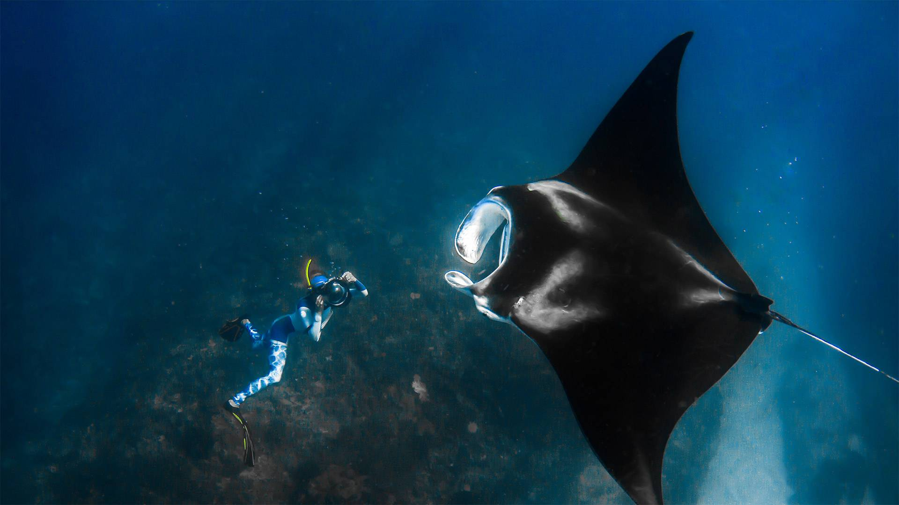

.. _bing_wallpaper:

====================
必应壁纸
====================

`Bing Wallpaper <https://www.microsoft.com/zh-cn/bing/bing-wallpaper>`_ 是我最喜欢的桌面背景，提供了精美的自然人文图片，以及简短的文字说明和快速搜索，甚至提供了地图标记功能(假如你有一天想去亲眼看一看)。

`xCss/bing <https://github.com/xCss/bing>`_ 开源项目通过抓取bing网站的壁纸提供了一个 `必应壁纸浏览下载 <https://bing.ioliu.cn/>`_ 网站，源代码采用 :ref:`nodejs` 开发。

2021年8月20日，我看到了如下一张静谧的图片，在深邃的海底，摄影师正在观察 ``巨型海洋蝠鲼`` ，无声无息、安详温柔：

联想到最近几天，阿富汗的动荡，美军的撤离以及塔利班攻占，那些渺小悲惨的个人，甚至抱着撤离军机的轮毂最终力竭坠亡......

自然无声而美丽，和人间的丑恶悲惨形成强烈震撼的对比...