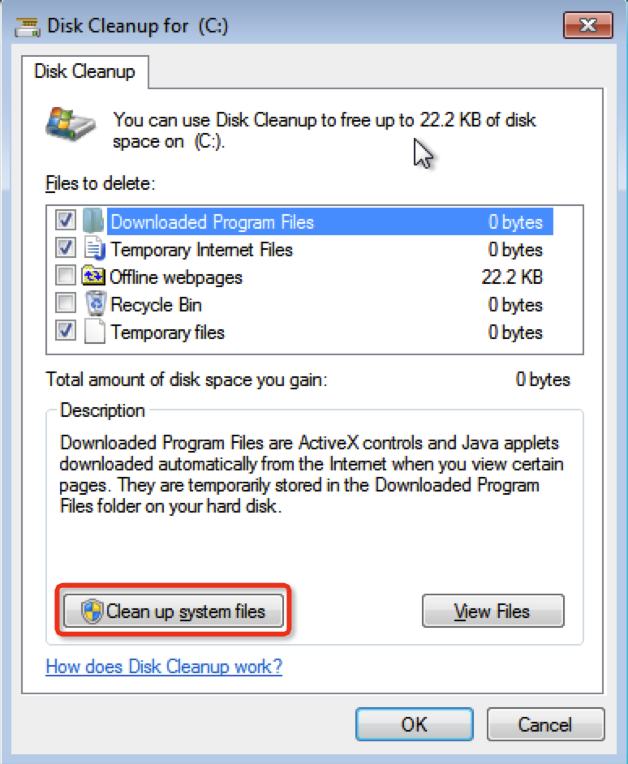
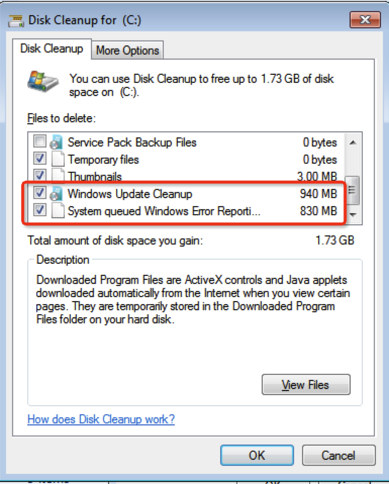
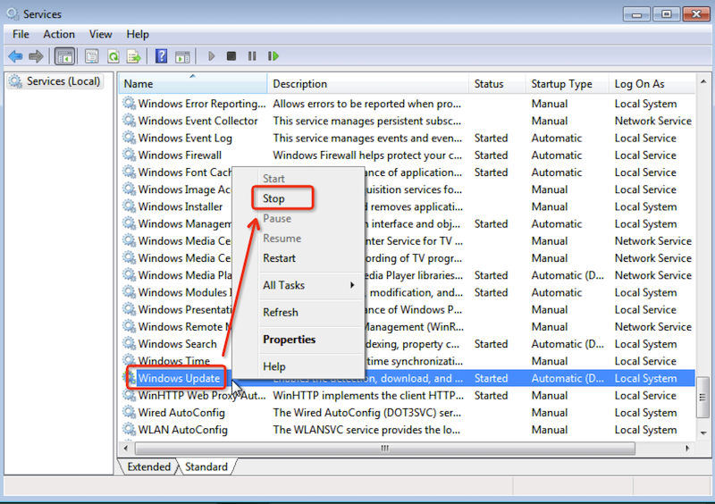

.. _delete_old_win_update_files:

==============================
清理旧Windows升级文件
==============================

我在 :ref:`kvm` 虚拟机中运行 :ref:`win7` ，由于 :ref:`priv_cloud_infra` 构建的 :ref:`ceph_rbd_libvirt` 存储容量有限 ，需要尽可能释放出虚拟机内部的磁盘空间。

Windows系统升级会在系统目录保留下载升级包，以便能够出现异常时卸载回滚。不过，如果系统稳定显然没有必要o

使用 ``Disk Cleanup`` 程序清理
================================

Windows提供了 ``Disk Cleanup`` 工具用来清理文件，不过默认不清理系统文件，所以在启动后需要再点一下 ``Clean up system files`` :

   点击 ``Clean up system files`` 按钮，可以增加清理系统文件

此时会再做一遍扫描，扫描完成后待清理文件列表就多了3项系统文件待清理:

   确认清理系统文件可以释放更多可用空间

点击确认后，可以释放出上GB的磁盘空间

从 ``Settings`` 中删除旧Windows更新文件
=======================================

.. note::

   :ref:`win10` 提供了 ``Settings > System > Storage > Temporary files`` 的清理方式，不过我当前使用 :ref:`win7` 所以没有执行这步

通过 ``SoftwareDistribution`` 目录清理
==========================================

在Windows目录下有一个特殊的 ``SoftwareDistribution`` 目录，存储了所有最新安装的更新下载。对于无需保留的旧更新，完全可以清理掉这个目录下内容来释放空间:

- 在启动菜单 ``Start menu`` 中输入 ``services`` 然后选择启动 ``Services`` 工具
- 在 ``Services`` 中找到 ``Windows Update`` 服务，然后右击该服务，选择 ``Stop``

   停止 ``Windows Update`` 服务以便清理更新文件

- 在 ``Run`` 对话框中输入 ``C:\Windows\SoftwareDistribution`` 并回车，此时就会打开 ``SoftwareDistribution`` 目录

- 按下 ``Ctrl + A`` 选择所有文件，然后重新在 ``Services`` 工具重新启动 ``Windows Update`` 服务

参考
======

- `How to Delete Old Windows Update Files <https://www.makeuseof.com/tag/delete-old-windows-update-files/>`_
