.. _win7_firewall_open_port:

============================
配置Windows 7防火墙允许端口
============================

我在 :ref:`win7` 平台 :ref:`install_vgpu_license_server` 遇到一个安装异常: 安装程序没有正确设置好需要对外开放的 ``7070`` 端口。所以需要手工配置，然而又发现Windows平台配置防火墙方式还比较曲折，并非能凭直觉完成，所以记录如下:

在Windows平台，防火墙不仅控制哪些端口对外开放，还可以控制哪些应用程序能够访问端口。不过，我一直以来都是运维 :ref:`linux` ，所以从Linux/Unix角度来看，直接配置系统对外开放哪些端口比较自然。

配置对外开放端口
==================

- 点击 ``Start`` 按钮输入或者再点击 ``Control Pannel``

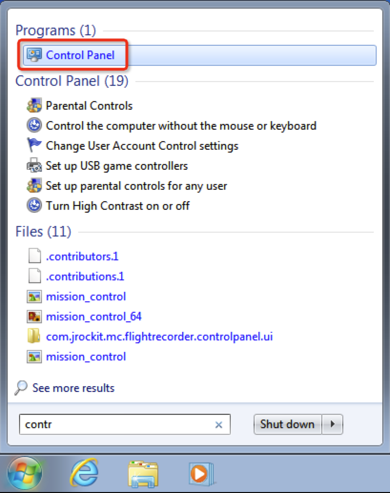

   启动 ``Control Pannel``

- 在 ``Control Pannel`` 中点击 ``System and Security`` ，然后再点击 ``Windows Firewall``

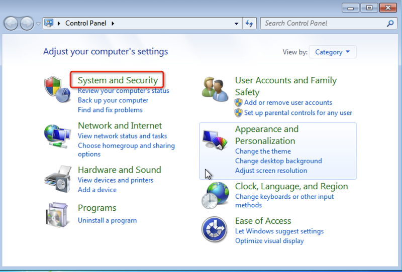

   点击 ``System and Security``

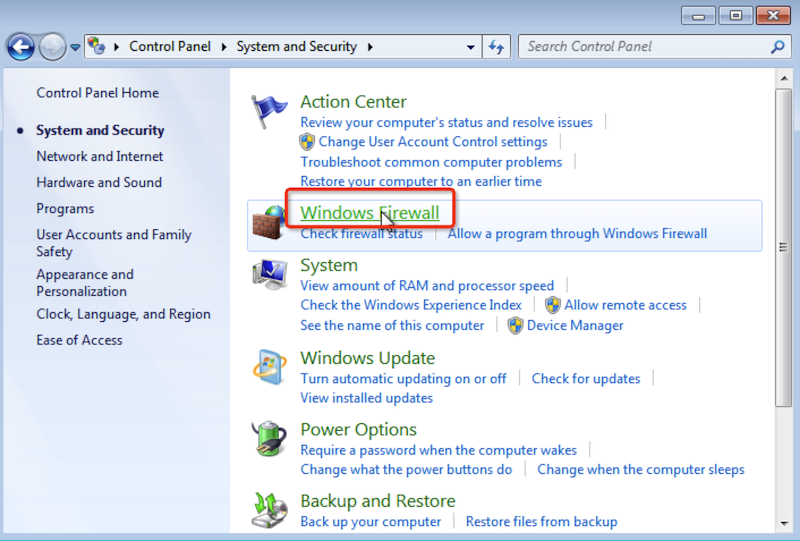

   点击 ``Windows Firewall``

- 在 ``Windoes Firewall`` 中，默认只有一些简单开启或关闭以及检查当前状态功能，此时我们需要点击 ``Advanced settings`` 

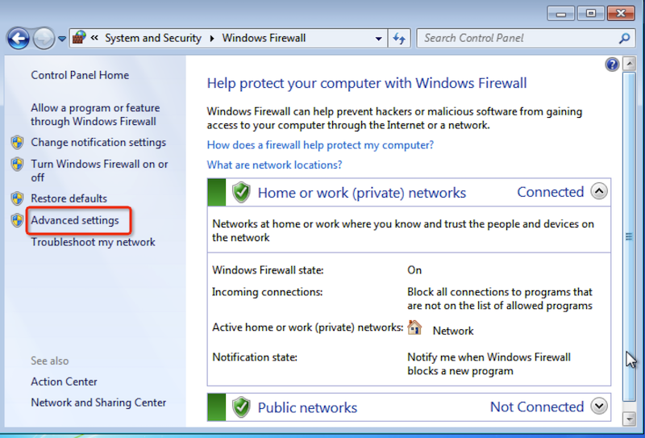

   点击 ``Windows Firewall`` 中的 ``Advanced settings``

- 在启动的 ``Windows Firewall with Advanced Security`` 工具中，点击左方导航栏 ``Inbound Rules`` 设置服务器进入方向的防火墙规则

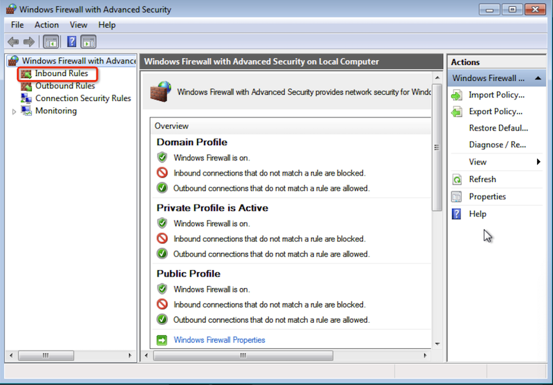

   设置 ``Windows Firewall`` 的服务器进入方向的防火墙规则

- 然后点击右侧 ``Actions`` 导航栏中的 ``New Rule...`` 添加一条新规则:

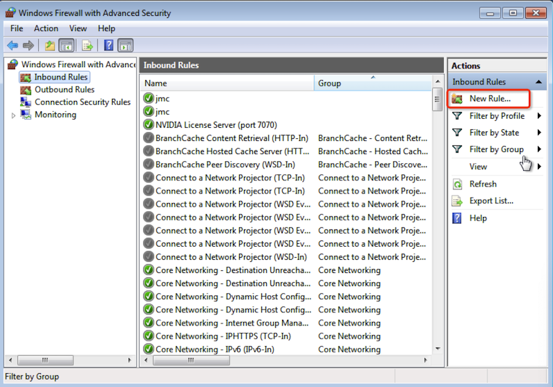

   点击右侧 ``Actions`` 导航栏中的 ``New Rule...``

- 选择 ``Port`` 作为创建类型:

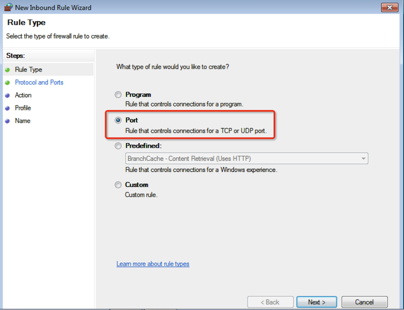

   选择 ``Port`` 作为新创建进入方向的防火墙规则类型

- 设置 ``TCP`` 协议类型并且设置允许端口 ``7070`` :

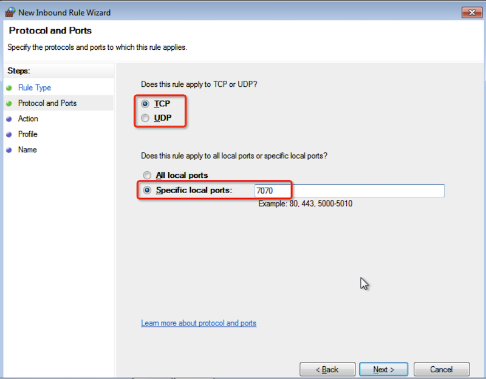

   选择 ``TCP`` 协议类型并且设置 ``7070`` 端口

- 选择 ``Allow the connection`` 允许访问(这里也可以设置阻止，或者只允许加密安全连接)

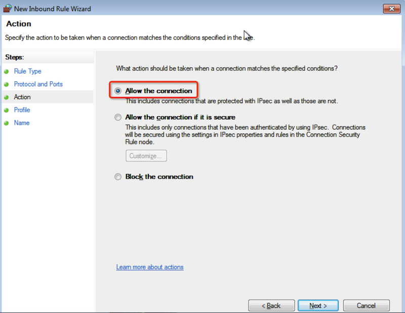

   允许进入连接

- 此外还可以细调在哪种网络环境允许这个规则，默认是都允许:

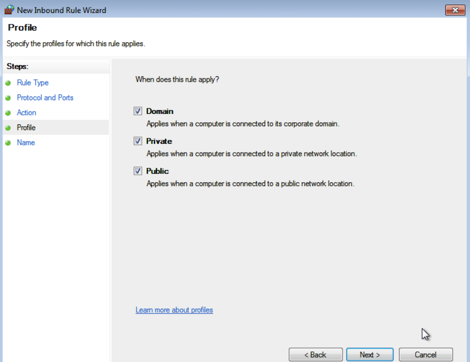

   允许哪种网络环境使用防火墙规则 

- 起一个容易辨识的规则名，例如 ``NVIDIA License Server (port 7070)``

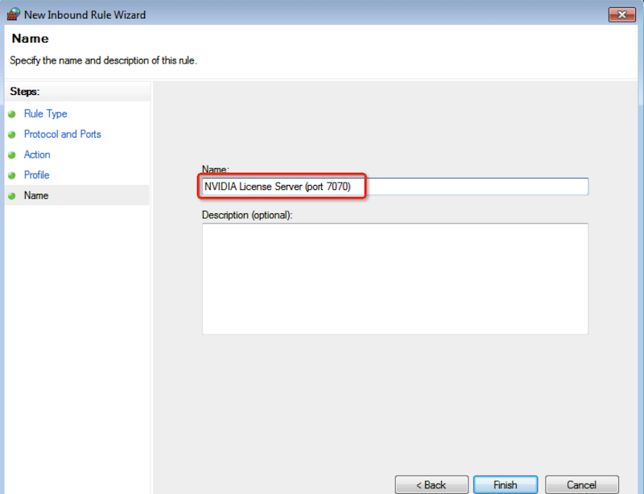

   设置防火墙规则的名字

然后点击 ``Finish`` 按钮就完成了 Windows 防火墙设置

参考
======

- `How to Open a Port in the Windows 7 Firewall <https://www.dummies.com/article/technology/computers/operating-systems/windows/windows-10/how-to-open-a-port-in-the-windows-7-firewall-206351/>`_
